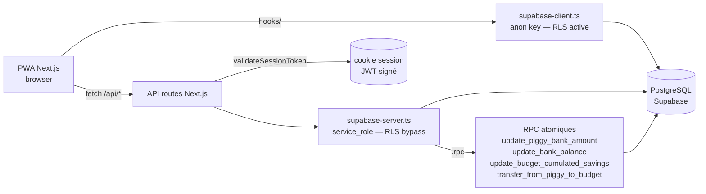
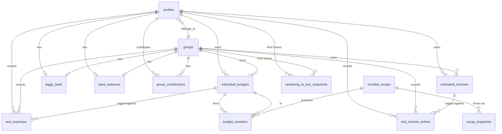

# Popoth

> Application web (PWA) francophone de gestion financière personnelle et en groupe.

Popoth aide un foyer ou un groupe à piloter mensuellement ses budgets : revenus estimés vs réels, dépenses planifiées vs réelles, économies cumulées par budget, tirelire commune, et un workflow de récap mensuel qui réconcilie le tout. La logique métier (allocation des dépenses, transferts inter-budgets, RAV — _reste à vivre_) est centralisée côté serveur ; le client est une PWA Next.js.

**Public cible** : un développeur seul ou en duo qui veut suivre ses finances avec des règles métier explicites (ordre d'imputation tirelire → économies budget → budget restant) plutôt qu'un agrégateur bancaire commercial.

---

## Sommaire

- [Stack](#stack)
- [Prérequis](#prérequis)
- [Installation](#installation)
- [Configuration](#configuration)
- [Commandes](#commandes)
- [Structure du projet](#structure-du-projet)
- [Architecture](#architecture)
- [Modèle de données](#modèle-de-données)
- [Tests & qualité](#tests--qualité)
- [Sécurité](#sécurité)
- [Déploiement](#déploiement)
- [Documentation](#documentation)
- [Conventions](#conventions)
- [Contribution](#contribution)
- [Licence](#licence)

---

## Stack

| Couche | Technos |
|---|---|
| Framework | **Next.js 16.2.6** (App Router, webpack en dev / Turbopack en build) |
| UI | **React 19.1.1**, **Tailwind 3**, **shadcn/ui** (variant new-york) |
| Langage | **TypeScript 5** strict (`noUncheckedIndexedAccess`, `verbatimModuleSyntax`) |
| Backend | API routes Next.js + **Supabase** (PostgreSQL + Auth) (`@supabase/supabase-js@^2.57.4`) |
| Auth | JWT custom (`jose`) — pas Supabase Auth direct |
| Tests | **Vitest 4.1.5** (env `node`) |
| Package manager | **pnpm 9.15.5** (verrouillé via `packageManager` + `engines.pnpm >=9.0.0`), Node ≥ 20.10.0 (`.nvmrc` pinné `20` LTS major) |

`eslint-config-next 15.0.0` reste sur la version Next 15 — incompatible avec Next 16, ne pas upgrader avant le Sprint 1.

---

## Prérequis

- [Node.js](https://nodejs.org/) ≥ 20.10 (utilisateurs `nvm` : `nvm use` lit [`.nvmrc`](./.nvmrc) qui pin sur la LTS major `20`)
- [pnpm](https://pnpm.io/) 9.x (`corepack enable && corepack prepare pnpm@9.15.5 --activate`)
- Un projet [Supabase](https://supabase.com/) (URL + clés service_role et anon)

Optionnel pour les opérations DB hors-app :
- Un [access token Supabase](https://supabase.com/dashboard/account/tokens) (`sbp_…`) pour scripts en API Management.
- Un mot de passe DB (Project Settings > Database > Reset password) pour `pnpm supabase ...`.

---

## Installation

```bash
git clone git@github.com:PothieuG/popoth.git
cd popoth
pnpm install
cp .env.example .env.local        # voir Configuration
pnpm dev                          # http://localhost:3000
```

> **Note historique** : le repo s'appelait `Popoth_App_Claude` jusqu'au rename Sprint Cleanup-Legacy / C3. GitHub redirige encore l'ancien URL ; nouveau clone → utiliser `popoth.git` directement.

---

## Configuration

`.env.local` (gitignored) doit contenir :

```ini
# Supabase
NEXT_PUBLIC_SUPABASE_URL=https://<your-project>.supabase.co
NEXT_PUBLIC_SUPABASE_PUBLISHABLE_KEY=...
NEXT_PUBLIC_SUPABASE_ANON_KEY=...
SUPABASE_SERVICE_ROLE_KEY=...     # utilisé par lib/supabase-server.ts (bypass RLS)

# Auth (JWT custom)
JWT_SECRET_KEY=...
```

Variables inline (jamais dans un fichier committé) pour les opérations CLI/scripts :

```ini
SUPABASE_ACCESS_TOKEN=sbp_...     # pour scripts/{export-schema,apply-sql,check-*}.mjs
SUPABASE_DB_PASSWORD=...          # pour pnpm supabase db push
```

Les tests gated lisent leurs propres variables : `SUPABASE_RPC_CONCURRENCY_TESTS=1`, `SUPABASE_RLS_TESTS=1`, `SUPABASE_API_TESTS=1`.

---

## Commandes

| Commande | Effet |
|---|---|
| `pnpm dev` | Serveur dev Next.js (webpack, HMR) |
| `pnpm build` | Build production (Turbopack) |
| `pnpm start` | Serveur production (après `build`) |
| `pnpm typecheck` | `tsc --noEmit` strict (BLOQUANT en CI) |
| `pnpm lint` | ESLint avec `--fix` |
| `pnpm lint:fix` | Alias de `pnpm lint` (conformité template canonique) |
| `pnpm lint:check` | ESLint sans modification — **BLOQUANT** depuis Sprint Lint-Baseline-Cleanup, exit 0 attendu (toute nouvelle violation sort la PR rouge via `code-checks.yml`) |
| `pnpm run ci` | Chaîne code-side : `typecheck` + `lint:check` + `test:run` + `build`. Exit 0 attendu. À invoquer via `pnpm run ci` (le bareword `pnpm ci` invoque le verb npm non implémenté par pnpm). |
| `pnpm test` | Vitest watch |
| `pnpm test:run` | Vitest single run (CI) |
| `pnpm db:types` | Régénère [lib/database.types.ts](./lib/database.types.ts) depuis le schéma prod |
| `pnpm db:diff` | Wrapper `supabase db diff` — pas dans le workflow réel, à préférer `pnpm db:check-drift` (le repo n'utilise pas Docker) |
| `pnpm db:reset` | Wrapper `supabase db reset` — **nécessite Docker local** (pas dans le workflow réel) |
| `pnpm db:check-drift` | Compare prod ↔ baseline `20260101000000_remote_schema.sql` |
| `pnpm db:check-rpcs` | Vérifie via `pg_proc` que les 4 RPC C3 existent en prod |
| `pnpm db:check-functions` | Vérifie via `pg_proc` que les 4 fonctions trigger custom existent (Sprint Audit-Triggers / A3) |
| `pnpm db:check-types-fresh` | Vérifie que [`lib/database.types.ts`](./lib/database.types.ts) correspond à ce que `supabase gen types --project-id <ref>` produirait à l'instant T contre prod. Exit 0 = synchro, 1 = stale + diff sur stdout, 2 = fatal (Sprint Hygiene-CI / E2) |
| `pnpm db:audit-functions` | **Audit générique** : liste TOUTES les `public.*` fonctions de `pg_proc` et vérifie chaque présence dans `supabase/migrations/` (Sprint Audit-Functions-v2 / B1) |
| `pnpm db:audit-objects` | **Audit générique étendu** : 5 catégories `pg_catalog` (functions, composite types, enums, domains, operators). À lancer après toute migration ajoutant un `CREATE TYPE` / `CREATE DOMAIN` / `CREATE OPERATOR` (Sprint Cleanup-Legacy / C2) |
| `pnpm verify` | **Meta-script sanity sweep** : enchaîne `typecheck` + `test:run` + les 6 `db:*` checks avec fail-fast (`&&`). Une commande à la place de huit après chaque sprint. ~36s en local (Sprint DX-Verify / G1) |
| `pnpm supabase ...` | CLI Supabase (lié au projet distant) |
| `node scripts/export-schema.mjs <out.sql>` | Snapshot du schéma prod via API Management |
| `node scripts/apply-sql.mjs <file.sql>` | Applique un .sql (write OU SELECT lecture seule) |
| `node scripts/apply-sql.mjs scripts/dump-functions.sql` | Dump pg_get_functiondef pour les fonctions PL/pgSQL captured (audit ad-hoc) |

**Tests gated** (la suite skip sans la variable, donc CI standard reste rapide) :

```bash
SUPABASE_RPC_CONCURRENCY_TESTS=1 pnpm test:run   # rpc-concurrency.test.ts
SUPABASE_RLS_TESTS=1            pnpm test:run   # rls-isolation.test.ts
SUPABASE_API_TESTS=1            pnpm test:run   # api-regressions.test.ts
SUPABASE_TRIGGER_TESTS=1        pnpm test:run   # trigger-behavior.test.ts (Sprint Audit-Functions-v2 / B2)
```

---

## Structure du projet

```
app/                       # App Router (pages + routes API)
  api/
    debug/                 # routes dev/seed — bloquées en prod via blockInProduction()
    finance/               # ✅ namespace canonique unifié (Sprint Refactor-Architecture v1+v2, livré 2026-05-08)
                           #   12 paths : summary, rav, budgets, budgets/estimated, incomes,
                           #   income/{real,estimated,progress}, expenses/{real,add-with-logic,preview-breakdown,progress}
                           #   Chaque route.ts ré-exporte les handlers depuis lib/api/finance/<route>.ts
    monthly-recap/         # workflow récap mensuel
    savings/transfer/      # transferts budget↔budget et budget↔tirelire
components/                # composants UI (shadcn/ui sous components/ui/)
contexts/                  # React contexts (AuthContext split en AuthUserContext + AuthActionsContext)
hooks/                     # 20 hooks React
  useRavValidation.ts      # validation { blocked, newRav } extraite de AddTransactionModal (Sprint Refactor-Architecture)
  useStep1Data.ts          # fetch /api/monthly-recap/step1-data + { data, loading, error, refresh }
  ...                      # useFinancialData, useGroups, useProfile, useBudgetProgress, ...
lib/
  supabase-server.ts       # client serveur (service_role, BYPASS RLS)
  supabase-client.ts       # client browser (anon key, soumis à RLS)
  database.types.ts        # types Supabase générés (inclut les 4 RPC C3 depuis Sprint Cleanup-Legacy / C1)
  session.ts               # JWT (jose) pour cookie session
  expense-allocation.ts    # règles d'allocation tirelire/savings/budget
  financial-calculations.ts # GOD FILE — chantier I4
  recap-snapshot.types.ts  # SnapshotPayload v1/v2 discriminé
  finance/                 # helpers RPC atomiques (piggy-bank, bank-balance, budget-savings)
    __tests__/             # rpc-concurrency, rls-isolation (gated)
  recap/
    check-status.ts        # ✅ checkRecapStatus(userId, context) Edge-safe — appelé directement par middleware.ts ET la route status (Sprint Refactor-Architecture)
  api/
    with-deprecation.ts    # helper : ajoute `Deprecation: true` à la response (utilisé par les anciens chemins gardés en alias)
    finance/               # 13 modules : handlers extraits, ré-exportés par app/api/finance/**/route.ts
  __tests__/               # api-regressions (gated)
scripts/                   # outils API Management (sans Docker)
  export-schema.mjs        # snapshot prod schema → SQL baseline
  apply-sql.mjs            # applique un .sql
  check-drift.mjs          # backend de pnpm db:check-drift
  check-rpcs.mjs           # backend de pnpm db:check-rpcs
  check-trigger-functions.mjs # backend de pnpm db:check-functions (4 fonctions custom)
  check-types-fresh.mjs    # backend de pnpm db:check-types-fresh (lib/database.types.ts ↔ prod)
  audit-functions.mjs      # backend de pnpm db:audit-functions (générique pg_proc ↔ migrations)
  audit-db-objects.mjs     # backend de pnpm db:audit-objects (5 catégories pg_catalog : functions, types, enums, domains, operators)
  dump-functions.sql       # dump pg_get_functiondef ad-hoc
  list-triggers.sql        # SELECT pg_trigger pour inventaire
.github/workflows/
  db-drift-check.yml       # cron weekly + on-demand (drift / rpcs / functions)
  db-drift-pr.yml          # PR-time gate sur paths DB-relevant
supabase/
  config.toml              # CLI config (lié au projet distant)
  migrations/              # baseline + migrations versionnées
docs/audit/                # audit complet codebase 2026-04
docs/db/                   # schéma + inventaire triggers
prompts/                   # prompts Claude Code par chantier (v0..v8)
CLAUDE.md                  # guide pour sessions Claude Code
```

---

## Architecture



**Points-clés** :
- Deux clients Supabase coexistent. Le **server** (`supabase-server.ts`) bypass RLS, utilisé par toutes les routes API. Le **browser** (`supabase-client.ts`) est soumis à RLS et utilisé uniquement par les hooks. Les failles RLS s'exploitent via le browser, pas le server.
- Les **écritures sur les invariants financiers** (`piggy_bank.amount`, `bank_balances.balance`, `estimated_budgets.cumulated_savings`) **doivent passer par les helpers `lib/finance/*`** qui appellent les 4 RPC atomiques `SECURITY DEFINER`. Pas de SELECT-then-UPDATE direct.
- L'**auth** est un JWT custom signé via `jose`, vérifié par `validateSessionToken(request)` dans chaque route API. Pas Supabase Auth direct côté serveur.
- Le **workflow récap mensuel** (`app/api/monthly-recap/*`) est un état-machine en 3 étapes ; le cœur algorithmique (`process-step1`, >700 LOC) reste un god file en attente de refactor (chantier I5).
- **Pattern API canonique** depuis Sprint Refactor-Architecture : les handlers vivent dans [`lib/api/finance/*`](./lib/api/finance/) (named exports `GET` / `POST` / etc.) et les `route.ts` sous [`app/api/finance/`](./app/api/finance/) ré-exportent. Ça permet aux handlers d'être importés ailleurs (tests, autres routes, middleware) sans dépendre de la convention `route.ts`. Les renames d'API utilisent le helper [`lib/api/with-deprecation.ts`](./lib/api/with-deprecation.ts) qui ajoute `Deprecation: true` à la response des anciens chemins pendant 1 sprint d'observation. Voir [docs/api/README.md](./docs/api/README.md) pour la liste complète des endpoints `/api/finance/*` et leurs shapes.
- **Edge runtime** (middleware) : pas de fetch HTTP self-call vers une route locale. Extraire la logique en lib pure et l'importer directement (pattern : [`lib/recap/check-status.ts`](./lib/recap/check-status.ts) appelé depuis [`middleware.ts`](./middleware.ts) ET la route API canonique). Vérifier que les imports transitifs restent Edge-safe (pas de `node:fs`, `node:path`, `next/headers`).

---

## Modèle de données



**Conventions DB** :
- Toutes les tables sont dans le schéma `public`.
- Pattern d'ownership : chaque ligne porte soit `profile_id` (perso), soit `group_id` (partagé), **jamais les deux** — enforce par CHECK `*_owner_exclusive_check`.
- IDs : `uuid PRIMARY KEY DEFAULT gen_random_uuid()`.
- RLS activée partout. Voir [docs/db/SCHEMA.md](./docs/db/SCHEMA.md) pour le détail policy par table.

---

## Tests & qualité

| Outil | Rôle |
|---|---|
| `pnpm typecheck` | TypeScript strict — bloquant |
| `pnpm lint:check` | ESLint — bloquant depuis Sprint Lint-Baseline-Cleanup (exit 0 attendu) |
| `pnpm test:run` | Vitest unit — toujours vert |
| `pnpm test:run` (gated) | Tests d'intégration contre Supabase prod, voir Configuration |
| `pnpm db:check-drift` | Compare prod ↔ baseline SQL — exit 1 si drift |
| `pnpm db:check-rpcs` | Vérifie les 4 RPC C3 dans `pg_proc` |
| `pnpm db:check-types-fresh` | Vérifie que `lib/database.types.ts` est à jour vs prod (Sprint Hygiene-CI / E2) |
| `pnpm verify` | **Sanity sweep** : `typecheck` + `test:run` + 6 `db:*` checks fail-fast en une commande (Sprint DX-Verify / G1) |

**Pas de mocks DB** dans les tests d'intégration (interdiction explicite — cf. CLAUDE.md §8). Les fixtures créent un `auth.users` réel via `admin.auth.admin.createUser` et nettoient en cascade dans `afterAll`.

**Post-modif / fin-de-sprint** : `pnpm verify` enchaîne les 8 checks séquentiels avec `&&` (fail-fast). Si une étape échoue, les suivantes ne sont pas spawnées — utile à la fois pour la rapidité du feedback et pour mitiger le `STATUS_STACK_BUFFER_OVERRUN` Windows observé en chaînant des supabase API calls back-to-back.

**Après merge d'une PR Dependabot** : enchaîner `git pull origin cleanup` → `pnpm install` → `pnpm verify` → `pnpm dev` + 1 `curl /` (les régressions runtime/CSS comme react/react-dom mismatch ou tailwindcss v4 PostCSS plugin missing ne se voient pas au typecheck). Depuis Sprint Stabilize-Deps / S2, [`.github/workflows/code-checks.yml`](./.github/workflows/code-checks.yml) re-tourne aussi sur `push: branches: [cleanup]`, donc une régression typecheck/test post-merge sort en CI rouge sans intervention. Le `pnpm dev` + `curl /` reste utile pour les régressions runtime/CSS que le filet CI ne couvre pas.

CI : `.github/workflows/` contient (a) un cron weekly DB-side `pnpm db:check-drift` + `db:check-rpcs` + `db:check-functions` + `db:check-types-fresh` (Sprint Hardening / H5, Sprint Audit-Triggers / A4, Sprint Hygiene-CI / E2) ; (b) un PR-time gate DB-side sur les paths `supabase/migrations/**` + `scripts/check-*.mjs` etc. (Sprint Audit-Functions-v2 / B3) ; (c) un **PR-time gate code-side** `pnpm typecheck` + `pnpm test:run` sur `**/*.ts` + configs (Sprint Code-CI / F1). Default branch GitHub : **`cleanup`** depuis Sprint Hygiene-CI / E3 (les workflows ne tournaient pas en mode `schedule` ni `workflow_dispatch` quand `main` était default car aucun fichier workflow n'a jamais été mergé dans `main`). Mises à jour de dépendances : [.github/dependabot.yml](.github/dependabot.yml) ouvre des PRs auto chaque lundi 08:00 Europe/Paris pour npm + github-actions, gated par les workflows ci-dessus (Sprint DX-Verify / G2).

---

## Sécurité

L'audit complet est dans [`docs/audit/00-executive-summary.md`](./docs/audit/00-executive-summary.md). État après Sprint Refactor-Architecture 2026-05-08 (~89/100) :

- ✅ Routes `/api/debug/*` bloquées en prod via [`lib/debug-guard.ts`](./lib/debug-guard.ts) — réponse 404 (pas 403, pour ne pas révéler l'existence).
- ✅ Mises à jour atomiques sur `piggy_bank` / `bank_balances` / `cumulated_savings` via 4 RPC `SECURITY DEFINER` (cf. [`supabase/migrations/20260506000000_create_finance_rpcs.sql`](./supabase/migrations/20260506000000_create_finance_rpcs.sql)). Tests de concurrence 100×parallèles dans `lib/finance/__tests__/rpc-concurrency.test.ts`.
- ✅ TypeScript strict appliqué au build (pas de `ignoreBuildErrors`).
- ✅ RLS activée partout, isolation cross-user testée (Sprint DB / D4).
- ✅ Drift detection automatisé : `pnpm db:check-drift`, `pnpm db:check-rpcs`, `pnpm db:check-functions`, GH Actions cron weekly + on-demand.
- ✅ **Triggers et fonctions PL/pgSQL versionnés** (Sprint Audit-Triggers / A1–A4) : les 6 triggers `public.*` sont dans le baseline + les 4 fonctions custom + le canonique `update_updated_at_column` sont capturés dans [`supabase/migrations/20260512000000_capture_trigger_functions.sql`](./supabase/migrations/20260512000000_capture_trigger_functions.sql). `calculate_group_contributions` (5ème fonction non-versionnée découverte en cours) est inclus.
- ✅ **Audit générique fonctions** (Sprint Audit-Functions-v2 / B1–B3) : `pnpm db:audit-functions` enumère toutes les `public.*` fonctions et confirme leur présence dans `supabase/migrations/`. Au premier run, 4 fonctions legacy supplémentaires ont été surfacées (toutes dead code) et capturées dans [`supabase/migrations/20260513000000_capture_legacy_functions.sql`](./supabase/migrations/20260513000000_capture_legacy_functions.sql). Tests comportement trigger ([`lib/__tests__/trigger-behavior.test.ts`](./lib/__tests__/trigger-behavior.test.ts), gated `SUPABASE_TRIGGER_TESTS=1`) couvrent les 4 fonctions custom (auto-create on JOIN, recalc on UPDATE, cascade DELETE, touch updated_at).
- ✅ **Cleanup legacy + audit étendu** (Sprint Cleanup-Legacy / C1–C3) : C1 a DROP les 4 fonctions legacy capturées en B1 ([`supabase/migrations/20260514000000_drop_legacy_functions.sql`](./supabase/migrations/20260514000000_drop_legacy_functions.sql)) — `pnpm db:audit-functions` est passé à 9 fonctions versionnées (vs 13). C2 a ajouté `pnpm db:audit-objects` ([`scripts/audit-db-objects.mjs`](./scripts/audit-db-objects.mjs)) pour couvrir 5 catégories `pg_catalog` (functions + types + enums + domains + operators). C3 a validé end-to-end le PR-time gate B3 et fixé 2 vrais bugs CI au passage : conflit `pnpm/action-setup@v4 ↔ packageManager` (le cron weekly n'avait jamais tourné depuis B3) + secret `SUPABASE_ACCESS_TOKEN` perdu lors du rename du repo.
- ✅ **Polish CI/DX** (Sprint Polish-CI / D1–D6) : D1 `pnpm db:types` self-redirige (le wrapper pnpm ne pollue plus le fichier généré). D2 `pnpm db:check-drift` idempotent face à CRLF Windows (root cause subtile : regex JS `.+$` ne consomme pas `\r`). D3 augmentation `lib/database.ts` supprimée — depuis le regen `--linked` (C1), les 4 RPC C3 sont dans les types générés et l'augmentation est devenue no-op (47 LOC + 6 imports migrés). D4 path filter du PR-time gate étendu aux 2 YAML eux-mêmes + `audit-*.mjs` (self-monitoring contre une régression C3 redux). D5 cron weekly à observer manuellement via `workflow_dispatch`. D6 Node.js 24 migration déférée à juin 2026.
- ✅ **Hygiene CI** (Sprint Hygiene-CI / E1–E3) : E1 [`.gitattributes`](./.gitattributes) ajouté avec `* text=auto eol=lf` — élimine le warning `LF will be replaced by CRLF` sur chaque commit Windows et obsolète le fix D2 en steady state (renormalize a été un no-op : repo + working tree étaient déjà LF en storage). E2 `pnpm db:check-types-fresh` ([`scripts/check-types-fresh.mjs`](./scripts/check-types-fresh.mjs)) : détecte une désynchro `lib/database.types.ts` ↔ prod via `supabase gen types --project-id <ref>` + line-by-line diff (utilise `--project-id` pour fonctionner sans `supabase link` préalable, output byte-identique à `--linked`). Wirage CI : 5e step ajouté à db-drift-pr.yml ET db-drift-check.yml. E3 validation `workflow_dispatch` du cron weekly → **3 vrais bugs surfacés et fixés** (workflow invisible UI car `main` n'avait aucun YAML, `--linked` fail en fresh CI checkout, 403 sur issue creation faute de `permissions: issues:write`). Filet CI désormais réellement opérationnel pour la première fois depuis Sprint Hardening / H5 (pattern miroir de Sprint Cleanup-Legacy / C3).
- ✅ **Code-side CI** (Sprint Code-CI / F1–F3) : F1 [`.github/workflows/code-checks.yml`](./.github/workflows/code-checks.yml) — premier PR-time gate code-side après 6 sprints DB-side. Sur tout PR touchant `**/*.ts` + configs : `pnpm typecheck` + `pnpm test:run` (avec `if: always()` pour que le test step fire même si typecheck échoue). Pattern miroir db-drift-pr.yml (pas de `with: version` sur `pnpm/action-setup@v4` — leçon C3). **Validé end-to-end via 2 PR tests** : (a) TS error → step "TypeScript check" rouge `error TS2322` exit 2 ; (b) test failure → step "Vitest single run" rouge `AssertionError` exit 1 (valide `if: always()` car typecheck était vert). Lint et build hors scope (lint = 136 errors pre-existants, build = besoin env vars Supabase). F2 `pnpm db:types` aligné sur `--project-id jzmppreybwabaeycvasz` (cohérence avec `db:check-types-fresh` post E2 hotfix, élimine la dépendance à `supabase link` pour les fresh clones, output byte-identique à `--linked`). F3 cosmetic : git remote local renommé `popoth.git` + README l.112 typo `--linked` → `--project-id` corrigé. **Observation collatérale** : warning Node.js 20 deprecation observé sur les 2 runs CI (~1 mois avant échéance 2 juin 2026 — défer Sprint Polish-CI / D6 inchangé).
- ✅ **Sanity sweep + Dependabot** (Sprint DX-Verify / G1–G2 + follow-up + Sprint Stabilize-Deps / S1–S3) : G1 `pnpm verify` enchaîne typecheck + tests + 6 `db:*` checks fail-fast (~36s). G2 [`.github/dependabot.yml`](./.github/dependabot.yml) auto-PR weekly lundi 08:00 Europe/Paris pour npm + github-actions, gated par les workflows ci-dessus. **1re wave Dependabot 2026-05-07** : 10 merges, 3 cassures (`@supabase/supabase-js@2.105` `RejectExcessProperties`, `react@19.2` alone sans react-dom, `tailwindcss@4` major rewrite) revertées via 6 commits (4 fix-forward + 1 group `react-stack` + 1 untrack `.claude/settings.local.json`). Sprint Stabilize-Deps a fermé les 2 trous du process : S1 `ignore` rules (tailwindcss `update-types: semver-major`, supabase-js `versions: ">=2.105.0"`, eslint-config-next `versions: ">=16.0.0"`) pour stopper la récidive ; S2 [`.github/workflows/code-checks.yml`](./.github/workflows/code-checks.yml) étendu à `push: branches: [cleanup]` pour valider l'état post-merge (le merge UI Dependabot ne re-trigger pas `pull_request:`). **Activation collatérale GitHub Advanced Security** : Dependency graph + Dependabot alerts + security updates + Grouped security updates ON. ⚠️ Nuance documentée CLAUDE.md §8 : les `versions: [...]` rules bloquent AUSSI les security PRs, donc un CVE sur supabase-js ≥2.105 ne déclenchera pas de security PR auto (Dependabot alert reste affiché — action manuelle requise pour temporairement retirer le `ignore`).
- ✅ **Lint baseline cleared** (Sprint Lint-Baseline-Cleanup, livré 2026-05-08) : 136 problems (125 errors + 11 warnings) → 0. `pnpm lint:check` désormais bloquant en CI via [`.github/workflows/code-checks.yml`](./.github/workflows/code-checks.yml) — toute nouvelle PR avec un `: any`, var inutilisée, ou warning `react-hooks/exhaustive-deps` non-justifié sort rouge. Patterns installés : (a) Supabase Insert/Update payloads typés via `Database['public']['Tables'][...]`, (b) catch sans binding `} catch {` quand l'erreur n'est pas utilisée, (c) `// eslint-disable-next-line <rule> -- <raison>` pour les rares disables légitimes (10 occurrences, toutes documentées). Bugs réels surfacés au passage : `recover.ts` v1/v2 type mismatch `bank_balance` / `piggy_bank` (boolean vs number), 4 blocs de code mort supprimés.
- ✅ **Sprint Lint-Followups** (livré 2026-05-08) : Item 1 fix `recover.ts` v1/v2 type mismatch — `bank_balance` / `piggy_bank` normalisés sur strict `boolean` partout, 3 régressions gated `SUPABASE_API_TESTS=1`. Item 2 triage Dependabot **31 → 0** : `next 16.1.6 → 16.2.6` + `postcss 8.5.6 → 8.5.14` direct, 12 `pnpm.overrides` pour transitives (minimatch, flatted, picomatch, brace-expansion, ajv, js-yaml, yaml, playwright, serialize-javascript, lodash, glob, postcss bundled). `pnpm audit` exit 0. Item 3 hook Husky `pre-push` ([`.husky/pre-push`](./.husky/pre-push)) lance `pnpm lint:check && pnpm typecheck` fail-fast — première gate locale alignée sur le PR gate.
- ✅ **Sprint Hygiène-Code** (livré 2026-05-08) : 4 chantiers en scope Medium, 4 commits (`a2e0b18` → `58620b9`). (1) Magic numbers extraits dans [`lib/constants/auth.ts`](./lib/constants/auth.ts) + [`lib/constants/finance.ts`](./lib/constants/finance.ts) — 13 substitutions (TTL session, intervalles refresh/auth-check, tolérance d'arrondi `0.01` recap step1). (2) Dead code : `getRemainingToLiveHistory` + `getGroupRemainingToLiveHistory` + interface `RemainingToLiveSnapshot` supprimés de [`lib/financial-calculations.ts`](./lib/financial-calculations.ts) (–95 LOC, 0 callsites). (3) Split `AuthContext` ([`contexts/AuthContext.tsx`](./contexts/AuthContext.tsx)) en `AuthUserContext` + `AuthActionsContext`, nouveaux hooks `useAuthUser()` / `useAuthActions()`, `useAuth()` rétro-compat agrégateur ; intervals migrés `useState` → `useRef`, public handlers `useCallback`. (4) Lazy-load 5 modals dans [`components/dashboard/PlanningDrawer.tsx`](./components/dashboard/PlanningDrawer.tsx) via `next/dynamic` + `ssr: false`. **Inventaire pré-sprint a invalidé 4 des 8 objectifs du prompt source** (audit 02 stale post-Lint-Baseline-Cleanup) : `: any` count = 0, silent catches déjà loggés, patterns `array[key]` safe, key listes déjà stables. Suite documentée dans [`prompts/prompt-02-code-quality-v2.md`](./prompts/prompt-02-code-quality-v2.md) (migration consumers AuthContext + extension lazy-load + closeout audit doc).
- ✅ **Sprint Hygiène-Code-v2** (livré 2026-05-08) : 3 items, 3 commits code + 1 closeout (`53a9c97` → closeout). (1) Migration des 4 single-concern consumers (`app/page.tsx` → `useAuthUser()` ; `dashboard` + `group-dashboard` + `settings` → nouveau `useLogoutAndRedirect()`) + refactor des internals de [`hooks/useAuth.ts`](./hooks/useAuth.ts) — chaque hook composé subscribe à la slice la plus narrow (`useRequireAuth` / `useRequireGuest` → `useAuthUser` only ; `useLogin` / `useRegister` → split user-state pour `error` et actions pour le reste). `useAuth()` agrégateur préservé inchangé pour rétro-compat (page connexion consumer-side inchangé, le bénéfice flow par les internals). (2) Lazy-load 3 modals outer-level (`AddTransactionModal` 491 LOC, `PlanningDrawer` 688 LOC, `SavingsDistributionDrawer` 540 LOC) via `next/dynamic` + `ssr: false` — étend le pattern de v1 à ≈1.7k LOC supplémentaires, le wrapper `SavingsDrawer` (29 LOC) reste static. (3) Header stale-content sur [`docs/audit/02-code-quality.md`](./docs/audit/02-code-quality.md) pointant vers la roadmap CLAUDE.md §11. Trouvaille au pré-sprint : `useRegister()` n'a aucun consumer (page inscription utilise `supabase.auth.signUp` direct) — refactoré pour cohérence d'API, pas supprimé.
- ✅ **Sprint Refactor-Architecture** (livré 2026-05-08) : 5 chantiers, 5 commits sur `cleanup` (`35c86e7` → `3601b28`). (1) Middleware self-call HTTP supprimé — extraction en [`lib/recap/check-status.ts`](./lib/recap/check-status.ts) Edge-safe, importée directement par middleware ET la route API canonique. (2) Namespace `/api/finance/*` unifié (13 routes) avec aliases rétro-compat taggés `Deprecation: true` via [`lib/api/with-deprecation.ts`](./lib/api/with-deprecation.ts) ; handlers extraits dans [`lib/api/finance/`](./lib/api/finance/) ; 29 fetch URLs migrées dans 7 hooks + 1 component ; 2 ambiguïtés résiduelles (`/api/finance/budgets` GET vs `/api/finance/budgets/estimated` GET ; `/api/finance/dashboard` vs `/api/finance/summary`) préservées zero-risk, cleanup planifié dans [`prompts/prompt-03-architecture-v2.md`](./prompts/prompt-03-architecture-v2.md). (3) [`hooks/useRavValidation.ts`](./hooks/useRavValidation.ts) extrait de l'IIFE inline de `AddTransactionModal` (memoize via `useMemo`). (4) [`hooks/useStep1Data.ts`](./hooks/useStep1Data.ts) extrait de `MonthlyRecapStep1` — hook custom maison `{ data, loading, error, refresh }`, pas TanStack Query. (5) [`hooks/useBudgetProgress.ts`](./hooks/useBudgetProgress.ts) déduplication state + sync effect → return `useMemo` direct. **Skip arbitré Phase 1** : Context local `PlanningDrawer` non créé après inventaire qui a montré que l'audit était stale (`context` ne traverse qu'1 niveau, pas 8+). PlanningDrawer reste structurellement inchangé.

L'historique des sprints sécurité est consigné dans [`CLAUDE.md`](./CLAUDE.md) §7.

---

## Déploiement

Pas de pipeline déploiement automatisé documenté. Le projet est conçu pour Vercel (Next.js stack) + Supabase managed (déjà provisionné sur `jzmppreybwabaeycvasz`). Les migrations sont appliquées via `pnpm supabase db push` ou `node scripts/apply-sql.mjs <fichier>` selon le cas (cf. CLAUDE.md §8 pour la push gate).

---

## Documentation

- [`CLAUDE.md`](./CLAUDE.md) — guide pour sessions [Claude Code](https://claude.com/claude-code) sur ce repo (conventions, à-faire/à-ne-pas-faire, état des lieux).
- [`docs/audit/`](./docs/audit/) — audit complet de la codebase (2026-04), 47/100 baseline, plan d'action multi-sprint.
  - [`00-executive-summary.md`](./docs/audit/00-executive-summary.md) — vue d'ensemble + score.
  - [`06-action-plan.md`](./docs/audit/06-action-plan.md) — plan multi-sprint.
  - [`RLS-FINDINGS.md`](./docs/audit/RLS-FINDINGS.md) — snapshot RLS pré-Sprint DB.
  - [`POST-MORTEM-C3-DRIFT.md`](./docs/audit/POST-MORTEM-C3-DRIFT.md) — post-mortem du drift `schema_migrations` ↔ `pg_proc`.
  - [`07-deep-dive-*.md`](./docs/audit/) — playbooks par chantier (financial-calculations, recap algorithm, RLS, testing strategy, Zod rollout, …).
- [`docs/db/SCHEMA.md`](./docs/db/SCHEMA.md) — carte des tables, RPC atomiques, indexes, FK, hot-path, inventaire complet des triggers prod.
- [`docs/api/README.md`](./docs/api/README.md) — référence rapide du namespace canonique `/api/finance/*` (Sprint Refactor-Architecture) : endpoints, verbes, query params, shapes de réponse.
- [`prompts/`](./prompts/) — prompts Claude Code par sprint, du Sprint 0 (v0) à Sprint Refactor-Architecture (livré). Voir [`prompts/README.md`](./prompts/README.md) pour le sommaire chronologique. Voir roadmap §11 dans [CLAUDE.md](./CLAUDE.md) pour les chantiers planifiés : Sprint Refactor-Architecture-v2 (cleanup deprecated + ambiguïtés résiduelles), Sprint 1 (Prettier/Husky lint-staged + eslint-config-next 15→16), Sprint Tailwind-v4, Sprint Supabase-Strict-Types, chantier I4 (financial-calculations), chantier I5 (process-step1), chantier console.log cleanup, chantier Zod rollout, GH Actions Node.js 24 migration (juin 2026).

---

## Conventions

Cf. [`CLAUDE.md`](./CLAUDE.md) §6 et §8 pour le détail. Résumé :

- **Format API** : `{ data: T } | { error: string }` partout, `401 'Session invalide'` si auth invalide, `404` (pas 403) pour les routes debug en prod.
- **TypeScript** : `import type` obligatoire (verbatimModuleSyntax), narrow systématique (noUncheckedIndexedAccess), pas de `any` dans le nouveau code, `as unknown as T` plutôt que `as any` quand un cast est inévitable.
- **Naming** : DB en `snake_case`, TS en `camelCase`, migrations Supabase nommées `<YYYYMMDDHHMMSS>_<verb>_<scope>.sql`.
- **Git** : Conventional Commits (`fix:`, `feat:`, `chore:`, `docs:`, `perf:`, `test:`), un commit par item dans les sprints multi-items, pas de `--amend` sur un commit publié, jamais `--no-verify` sans demande explicite.
- **DB writes** : pour `piggy_bank`/`bank_balances`/`cumulated_savings`, **toujours** via les helpers `lib/finance/*`. Pas de SELECT-then-UPDATE direct.

---

## Contribution

Le repo est privé et maintenu en solo aujourd'hui. Si vous arrivez sur ce code via un fork ou une collaboration ad-hoc :

1. **Lire d'abord** [`CLAUDE.md`](./CLAUDE.md) — c'est le guide de référence pour les conventions, les pièges connus, l'historique des sprints (§7), et la roadmap (§11). Le fichier est dense mais à jour.
2. **Branche par sujet** : créer une branche depuis `cleanup` (la default branch — cf. Sprint Hygiene-CI / E3 dans CLAUDE.md §11). Pas depuis `main` (gelé à 3 commits derrière).
3. **PR vers `cleanup`** : tout PR sera gaté par 2 workflows GitHub Actions :
   - `code-checks.yml` — `pnpm typecheck` + `pnpm test:run` sur tout PR touchant `**/*.ts` ou les configs (Sprint Code-CI / F1). Tourne aussi sur `push: branches: [cleanup]` pour valider l'état post-merge (Sprint Stabilize-Deps / S2 — ferme le trou des merges UI Dependabot qui ne re-triggerent pas `pull_request:`).
   - `db-drift-pr.yml` — `pnpm db:check-drift` + 3 autres détecteurs sur tout PR touchant `supabase/migrations/**` ou les types générés (Sprint Audit-Functions-v2 / B3, Sprint Hygiene-CI / E2).
4. **Commits** : Conventional Commits (`fix:`, `feat:`, `chore:`, `docs:`, `perf:`, `test:`), un commit par item logique. Voir CLAUDE.md §6 (Git).
5. **Migrations DB** : suivre le push gate de CLAUDE.md §8 (`pnpm supabase db push --dry-run` → STOP confirmation → `db push` → re-audit Management API → commit). Pour rétro-capturer une fonction PL/pgSQL ou DROP un objet legacy, suivre les workflows capture-then-drop / capture rétroactive documentés dans CLAUDE.md §8.
6. **Tests d'intégration gated** : `SUPABASE_RPC_CONCURRENCY_TESTS=1` etc. créent de vraies données dans Supabase prod. À lancer manuellement uniquement, jamais en CI.

Issues / discussions : pas de canal formel aujourd'hui (repo privé, mainteneur solo).

---

## Licence

Privé. Aucune licence open-source attribuée.
