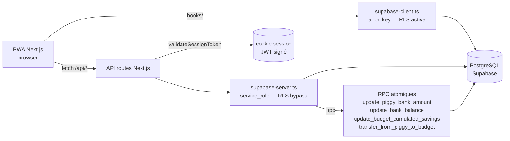
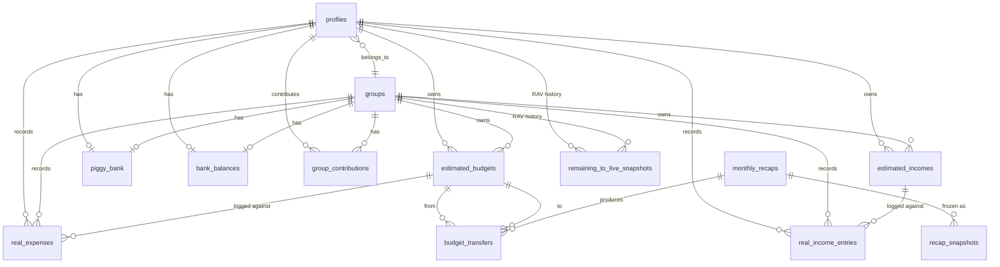

# Popoth

> Application web (PWA) francophone de gestion financière personnelle et en groupe.

Popoth aide un foyer ou un groupe à piloter mensuellement ses budgets : revenus estimés vs réels, dépenses planifiées vs réelles, économies cumulées par budget, tirelire commune, et un workflow de récap mensuel qui réconcilie le tout. La logique métier (allocation des dépenses, transferts inter-budgets, RAV — _reste à vivre_) est centralisée côté serveur ; le client est une PWA Next.js.

**Public cible** : un développeur seul ou en duo qui veut suivre ses finances avec des règles métier explicites (ordre d'imputation tirelire → économies budget → budget restant) plutôt qu'un agrégateur bancaire commercial.

---

## Sommaire

- [Stack](#stack)
- [Prérequis](#prérequis)
- [Installation](#installation)
- [Configuration](#configuration)
- [Commandes](#commandes)
- [Structure du projet](#structure-du-projet)
- [Architecture](#architecture)
- [Modèle de données](#modèle-de-données)
- [Tests & qualité](#tests--qualité)
- [Sécurité](#sécurité)
- [Déploiement](#déploiement)
- [Documentation](#documentation)
- [Conventions](#conventions)
- [Contribution](#contribution)
- [Licence](#licence)

---

## Stack

| Couche          | Technos                                                                                                                    |
| --------------- | -------------------------------------------------------------------------------------------------------------------------- |
| Framework       | **Next.js 16.2.6** (App Router, webpack en dev / Turbopack en build)                                                       |
| UI              | **React 19.1.1**, **Tailwind 3**, **shadcn/ui** (variant new-york)                                                         |
| Data fetching   | **TanStack Query 5.100.9** (`@tanstack/react-query` + devtools dev-only) — Sprint 1.5                                      |
| Langage         | **TypeScript 5** strict (`noUncheckedIndexedAccess`, `verbatimModuleSyntax`)                                               |
| Backend         | API routes Next.js + **Supabase** (PostgreSQL + Auth) (`@supabase/supabase-js@^2.57.4`)                                    |
| Auth            | JWT custom (`jose`) — pas Supabase Auth direct                                                                             |
| Tests           | **Vitest 4.1.5** (env `node`)                                                                                              |
| Lint / Format   | **ESLint 9.39.4** + **eslint-config-next 16.2.6** (flat config natif) + **Prettier 3.8.3** + `prettier-plugin-tailwindcss` |
| Hooks Git       | **Husky 9** — `pre-commit` (lint-staged sur fichiers staged) + `pre-push` (`lint:check && typecheck` full-tree)            |
| Package manager | **pnpm 9.15.5** (verrouillé via `packageManager` + `engines.pnpm >=9.0.0`), Node ≥ 20.10.0 (`.nvmrc` pinné `20` LTS major) |

---

## Prérequis

- [Node.js](https://nodejs.org/) ≥ 20.10 (utilisateurs `nvm` : `nvm use` lit [`.nvmrc`](./.nvmrc) qui pin sur la LTS major `20`)
- [pnpm](https://pnpm.io/) 9.x (`corepack enable && corepack prepare pnpm@9.15.5 --activate`)
- Un projet [Supabase](https://supabase.com/) (URL + clés service_role et anon)

Optionnel pour les opérations DB hors-app :

- Un [access token Supabase](https://supabase.com/dashboard/account/tokens) (`sbp_…`) pour scripts en API Management.
- Un mot de passe DB (Project Settings > Database > Reset password) pour `pnpm supabase ...`.

---

## Installation

```bash
git clone git@github.com:PothieuG/popoth.git
cd popoth
pnpm install
cp .env.example .env.local        # voir Configuration
pnpm dev                          # http://localhost:3000
```

> **Note historique** : le repo s'appelait `Popoth_App_Claude` jusqu'au rename Sprint Cleanup-Legacy / C3. GitHub redirige encore l'ancien URL ; nouveau clone → utiliser `popoth.git` directement.

---

## Configuration

`.env.local` (gitignored) doit contenir :

```ini
# Supabase
NEXT_PUBLIC_SUPABASE_URL=https://<your-project>.supabase.co
NEXT_PUBLIC_SUPABASE_PUBLISHABLE_KEY=...
NEXT_PUBLIC_SUPABASE_ANON_KEY=...
SUPABASE_SERVICE_ROLE_KEY=...     # utilisé par lib/supabase-server.ts (bypass RLS)

# Auth (JWT custom)
JWT_SECRET_KEY=...
```

Variables inline (jamais dans un fichier committé) pour les opérations CLI/scripts :

```ini
SUPABASE_ACCESS_TOKEN=sbp_...     # pour scripts/{export-schema,apply-sql,check-*}.mjs
SUPABASE_DB_PASSWORD=...          # pour pnpm supabase db push
```

Les tests gated lisent leurs propres variables : `SUPABASE_RPC_CONCURRENCY_TESTS=1`, `SUPABASE_RLS_TESTS=1`, `SUPABASE_API_TESTS=1`.

---

## Commandes

| Commande                                                | Effet                                                                                                                                                                                                                                              |
| ------------------------------------------------------- | -------------------------------------------------------------------------------------------------------------------------------------------------------------------------------------------------------------------------------------------------- |
| `pnpm dev`                                              | Serveur dev Next.js (webpack, HMR)                                                                                                                                                                                                                 |
| `pnpm build`                                            | Build production (Turbopack)                                                                                                                                                                                                                       |
| `pnpm start`                                            | Serveur production (après `build`)                                                                                                                                                                                                                 |
| `pnpm typecheck`                                        | `tsc --noEmit` strict (BLOQUANT en CI)                                                                                                                                                                                                             |
| `pnpm lint`                                             | ESLint avec `--fix`                                                                                                                                                                                                                                |
| `pnpm lint:fix`                                         | Alias de `pnpm lint` (conformité template canonique)                                                                                                                                                                                               |
| `pnpm lint:check`                                       | ESLint sans modification — **BLOQUANT** depuis Sprint Lint-Baseline-Cleanup, exit 0 attendu (toute nouvelle violation sort la PR rouge via `code-checks.yml`). Sprint 1 a upgradé à ESLint 9 + eslint-config-next 16 (flat config natif).          |
| `pnpm format`                                           | Prettier `--write` sur tout le repo (Sprint 1). Idempotent ; à utiliser avant un commit volumineux ou après modif de `.prettierrc.json`. **Ne pas lancer dans une PR feature** — le diff est mécanique mais massif.                                |
| `pnpm format:check`                                     | Prettier `--check` sans écriture — **BLOQUANT** en CI depuis Sprint 1 (`code-checks.yml`).                                                                                                                                                         |
| `pnpm run ci`                                           | Chaîne code-side : `typecheck` + `lint:check` + `format:check` + `test:run` + `build`. Exit 0 attendu. À invoquer via `pnpm run ci` (le bareword `pnpm ci` invoque le verb npm non implémenté par pnpm).                                           |
| `pnpm test`                                             | Vitest watch                                                                                                                                                                                                                                       |
| `pnpm test:run`                                         | Vitest single run (CI)                                                                                                                                                                                                                             |
| `pnpm test:coverage`                                    | Vitest single run avec rapport couverture v8 (Sprint Templates-Triage). Ad-hoc, pas dans `pnpm verify`/`ci`. Écrit dans `coverage/` (gitignored)                                                                                                   |
| `pnpm db:types`                                         | Régénère [lib/database.types.ts](./lib/database.types.ts) depuis le schéma prod                                                                                                                                                                    |
| `pnpm db:diff`                                          | Wrapper `supabase db diff` — pas dans le workflow réel, à préférer `pnpm db:check-drift` (le repo n'utilise pas Docker)                                                                                                                            |
| `pnpm db:reset`                                         | Wrapper `supabase db reset` — **nécessite Docker local** (pas dans le workflow réel)                                                                                                                                                               |
| `pnpm db:check-drift`                                   | Compare prod ↔ baseline `20260101000000_remote_schema.sql`                                                                                                                                                                                         |
| `pnpm db:check-rpcs`                                    | Vérifie via `pg_proc` que les 4 RPC C3 existent en prod                                                                                                                                                                                            |
| `pnpm db:check-functions`                               | Vérifie via `pg_proc` que les 4 fonctions trigger custom existent (Sprint Audit-Triggers / A3)                                                                                                                                                     |
| `pnpm db:check-types-fresh`                             | Vérifie que [`lib/database.types.ts`](./lib/database.types.ts) correspond à ce que `supabase gen types --project-id <ref>` produirait à l'instant T contre prod. Exit 0 = synchro, 1 = stale + diff sur stdout, 2 = fatal (Sprint Hygiene-CI / E2) |
| `pnpm db:audit-functions`                               | **Audit générique** : liste TOUTES les `public.*` fonctions de `pg_proc` et vérifie chaque présence dans `supabase/migrations/` (Sprint Audit-Functions-v2 / B1)                                                                                   |
| `pnpm db:audit-objects`                                 | **Audit générique étendu** : 5 catégories `pg_catalog` (functions, composite types, enums, domains, operators). À lancer après toute migration ajoutant un `CREATE TYPE` / `CREATE DOMAIN` / `CREATE OPERATOR` (Sprint Cleanup-Legacy / C2)        |
| `pnpm verify`                                           | **Meta-script sanity sweep** : enchaîne `typecheck` + `test:run` + les 6 `db:*` checks avec fail-fast (`&&`). Une commande à la place de huit après chaque sprint. ~36s en local (Sprint DX-Verify / G1)                                           |
| `pnpm supabase ...`                                     | CLI Supabase (lié au projet distant)                                                                                                                                                                                                               |
| `node scripts/export-schema.mjs <out.sql>`              | Snapshot du schéma prod via API Management                                                                                                                                                                                                         |
| `node scripts/apply-sql.mjs <file.sql>`                 | Applique un .sql (write OU SELECT lecture seule)                                                                                                                                                                                                   |
| `node scripts/apply-sql.mjs scripts/dump-functions.sql` | Dump pg_get_functiondef pour les fonctions PL/pgSQL captured (audit ad-hoc)                                                                                                                                                                        |

**Tests gated** (la suite skip sans la variable, donc CI standard reste rapide) :

```bash
SUPABASE_RPC_CONCURRENCY_TESTS=1 pnpm test:run   # rpc-concurrency.test.ts
SUPABASE_RLS_TESTS=1            pnpm test:run   # rls-isolation.test.ts
SUPABASE_API_TESTS=1            pnpm test:run   # api-regressions.test.ts
SUPABASE_TRIGGER_TESTS=1        pnpm test:run   # trigger-behavior.test.ts (Sprint Audit-Functions-v2 / B2)
```

---

## Structure du projet

```
app/                       # App Router (pages + routes API)
  api/
    debug/                 # routes dev/seed — bloquées en prod via blockInProduction() (skipped du wrapper auth)
    finance/               # ✅ namespace canonique unifié (Sprint Refactor-Architecture v1+v2, livré 2026-05-08) — 12 paths sous le wrapper withAuth(AndProfile) depuis v3
                           #   summary, rav, budgets, budgets/estimated, incomes,
                           #   income/{real,estimated,progress}, expenses/{real,add-with-logic,preview-breakdown,progress}
                           #   Chaque route.ts ré-exporte les handlers depuis lib/api/finance/<route>.ts
    monthly-recap/         # workflow récap mensuel — 13 routes wrappées en withAuth(AndProfile) en v4 (process-step1 god route exclue)
    savings/{data,transfer}/ # données + transferts budget↔budget et budget↔tirelire — wrappées en v4
    bank-balance/          # solde bancaire user/group — wrappée en v4 (withAuth + lazy fetch)
    profile/               # CRUD profil — wrappée en v4 (withAuth + manual select('*'))
    groups/                # 5 routes (list/create, search, contributions, [id], [id]/members) — wrappées en v4 (withAuthAndProfile, dont 2 dynamiques)
components/                # composants UI (shadcn/ui sous components/ui/)
  providers/QueryProvider.tsx # ✅ Sprint 1.5 — 'use client' wrapper QueryClientProvider + ReactQueryDevtools (dev only)
contexts/                  # React contexts (AuthContext split en AuthUserContext + AuthActionsContext)
hooks/                     # 20 hooks React — ✅ Sprint 1.5 : 11 hooks fetcher migrés sur TanStack Query
  useRavValidation.ts      # validation { blocked, newRav } extraite de AddTransactionModal (Sprint Refactor-Architecture)
  useStep1Data.ts          # ✅ Sprint 1.5 — useQuery({ queryKey: ['step1-data', context] })
  useFinancialData.ts      # ✅ Sprint 1.5 + Sprint 2 — useQuery natif. Le bridge legacy `triggerFinancialRefresh`/`registerFinancialRefreshCallback` est supprimé : les mutations cross-domain invalident désormais directement les 3 keys (`['financial-summary']`, `['progress-data']`, `['budgets']`) via [`invalidateFinancialRefreshes`](./lib/query-client.ts) (single source of truth depuis Sprint 2-followup)
  useBudgets.ts            # ✅ Sprint 1.5 — useQuery + 3 useMutation (add/update/delete) avec setQueryData
  useIncomes.ts            # ✅ Sprint 1.5 — useQuery + 3 useMutation
  useRealExpenses.ts       # ✅ Sprint 1.5 — useQuery + 3 useMutation (smart-allocation)
  useRealIncomes.ts        # ✅ Sprint 1.5 — useQuery + 3 useMutation
  useProfile.ts            # ✅ Sprint 1.5 — useQuery + 2 useMutation
  useGroups.ts             # ✅ Sprint 1.5 — useQuery + 5 useMutation (incl. join/leave)
  useExpenseProgress.ts    # ✅ Sprint 1.5 — useQuery (fetcher pur)
  useIncomeProgress.ts     # ✅ Sprint 1.5 — derived useMemo (pas Query, dépend de useRealIncomes)
  useProgressData.ts       # ✅ Sprint 1.5 — useQuery, le contextRef pattern C ref site éliminé natif via queryKey
  useBudgetProgress.ts     # dedupe state + sync effect → return useMemo direct (Sprint Refactor-Architecture)
lib/
  query-client.ts          # ✅ Sprint 1.5 — createQueryClient() factory (staleTime 30s, refetchOnWindowFocus false, retry 1)
  supabase-server.ts       # client serveur (service_role, BYPASS RLS)
  supabase-client.ts       # client browser (anon key, soumis à RLS)
  database.types.ts        # types Supabase générés (inclut les 4 RPC C3 depuis Sprint Cleanup-Legacy / C1)
  session.ts               # JWT (jose) pour cookie session
  expense-allocation.ts    # règles d'allocation tirelire/savings/budget
  financial-calculations.ts # GOD FILE — chantier I4
  recap-snapshot.types.ts  # SnapshotPayload v1/v2 discriminé
  finance/                 # helpers RPC atomiques (piggy-bank, bank-balance, budget-savings)
    __tests__/             # rpc-concurrency, rls-isolation (gated)
  recap/
    check-status.ts        # ✅ checkRecapStatus(userId, context) Edge-safe — appelé directement par middleware.ts ET la route status (Sprint Refactor-Architecture)
  api/
    with-auth.ts           # ✅ Sprint Refactor-Architecture-v3+v4+v5 — withAuth + withAuthAndProfile higher-order helpers utilisés par 34 modules (12 finance + 21 Volet C + process-step1 depuis v5). Profile shape étendu en v4 à { id, group_id, first_name, last_name }. Signature étendue avec 2 overloads en v5 : (a) static-route sans routeContext, (b) dynamic-route avec generic `<TParams>` et routeContext NON-optionnel (élimine le `routeContext!` dans groups/[id]/**).
    finance/               # 12 modules : handlers extraits, ré-exportés par app/api/finance/**/route.ts (tous wrappés en withAuth/withAuthAndProfile depuis v3)
    __tests__/             # with-auth (gated SUPABASE_API_TESTS=1, Sprint v5)
  __tests__/               # api-regressions (gated)
scripts/                   # outils API Management (sans Docker)
  export-schema.mjs        # snapshot prod schema → SQL baseline
  apply-sql.mjs            # applique un .sql
  check-drift.mjs          # backend de pnpm db:check-drift
  check-rpcs.mjs           # backend de pnpm db:check-rpcs
  check-trigger-functions.mjs # backend de pnpm db:check-functions (4 fonctions custom)
  check-types-fresh.mjs    # backend de pnpm db:check-types-fresh (lib/database.types.ts ↔ prod)
  audit-functions.mjs      # backend de pnpm db:audit-functions (générique pg_proc ↔ migrations)
  audit-db-objects.mjs     # backend de pnpm db:audit-objects (5 catégories pg_catalog : functions, types, enums, domains, operators)
  dump-functions.sql       # dump pg_get_functiondef ad-hoc
  list-triggers.sql        # SELECT pg_trigger pour inventaire
.github/workflows/
  db-drift-check.yml       # cron weekly + on-demand (drift / rpcs / functions)
  db-drift-pr.yml          # PR-time gate sur paths DB-relevant
supabase/
  config.toml              # CLI config (lié au projet distant)
  migrations/              # baseline + migrations versionnées
docs/audit/                # audit complet codebase 2026-04
docs/db/                   # schéma + inventaire triggers
prompts/                   # prompts Claude Code par chantier (v0..v8)
CLAUDE.md                  # guide pour sessions Claude Code
```

---

## Architecture



**Points-clés** :

- Deux clients Supabase coexistent. Le **server** (`supabase-server.ts`) bypass RLS, utilisé par toutes les routes API. Le **browser** (`supabase-client.ts`) est soumis à RLS et utilisé uniquement par les hooks. Les failles RLS s'exploitent via le browser, pas le server.
- Les **écritures sur les invariants financiers** (`piggy_bank.amount`, `bank_balances.balance`, `estimated_budgets.cumulated_savings`) **doivent passer par les helpers `lib/finance/*`** qui appellent les 4 RPC atomiques `SECURITY DEFINER`. Pas de SELECT-then-UPDATE direct.
- L'**auth** est un JWT custom signé via `jose`, vérifié par `validateSessionToken(request)` dans chaque route API. Pas Supabase Auth direct côté serveur.
- Le **workflow récap mensuel** (`app/api/monthly-recap/*`) est un état-machine en 3 étapes ; le cœur algorithmique (`process-step1`, >700 LOC) reste un god file en attente de refactor (chantier I5).
- **Pattern API canonique** depuis Sprint Refactor-Architecture : les handlers vivent dans [`lib/api/finance/*`](./lib/api/finance/) (named exports `GET` / `POST` / etc.) et les `route.ts` sous [`app/api/finance/`](./app/api/finance/) ré-exportent. Ça permet aux handlers d'être importés ailleurs (tests, autres routes, middleware) sans dépendre de la convention `route.ts`. Lors d'un rename d'API, wrapper l'ancien handler pour ajouter `response.headers.set('Deprecation', 'true')` (un helper `lib/api/with-deprecation.ts` a existé entre v1 et v2 puis a été supprimé après cleanup — le recréer ad-hoc si besoin). Voir [docs/api/README.md](./docs/api/README.md) pour la liste complète des endpoints `/api/finance/*` et leurs shapes.
- **Auth boilerplate extrait** depuis Sprint Refactor-Architecture-v3 + v4 + v5 : **34 modules** (12 finance + 21 Volet C : profile, savings, bank-balance, groups, monthly-recap + `process-step1` auth header depuis v5) utilisent `withAuth(handler)` (auth seule, passe `{ userId }`) ou `withAuthAndProfile(handler)` (auth + fetch `select('id, group_id, first_name, last_name')`, passe `{ userId, profile }`) depuis [`lib/api/with-auth.ts`](./lib/api/with-auth.ts). Le wrapper rejette les requêtes non authentifiées avec `401 'Session invalide'` (CLAUDE.md §6) ou `404 'Profil non trouvé'` (`withAuthAndProfile` uniquement). **Pas de try/catch dans le wrapper** — chaque handler garde son `try/catch` route-aware avec `console.error` ; permet à `summary.ts` et `profile.ts:GET` de préserver leurs fallbacks (200-with-default / 200-on-no-profile). Routes hors scope du wrapper : `app/api/debug/**` (blockInProduction d'abord), `app/api/auth/**` (créent/rafraîchissent la session). Le `process-step1/route.ts` est wrap pour son auth header depuis v5 — l'extraction de la logique métier reste chantier I5 séparé. **Pour les routes dynamiques** (e.g. `app/api/groups/[id]/route.ts`) : utiliser le generic 2nd arg `withAuth<RouteParams>(async (req, ctx, routeContext) => { const { id } = await routeContext.params })` — depuis Sprint v5, l'overload TS rend `routeContext` non-optionnel quand `TParams` est fourni, donc plus besoin du `!` (le compte est désormais 0 dans `app/api/`). Pattern canonique : `export const POST = withAuthAndProfile(async (request, { userId, profile }) => { ... })`. Tests couvrant les 2 helpers + les overloads + l'isolation parallèle dans [`lib/api/__tests__/with-auth.test.ts`](./lib/api/__tests__/with-auth.test.ts) (gated `SUPABASE_API_TESTS=1`, 12 cas — Sprint v5).
- **Edge runtime** (middleware) : pas de fetch HTTP self-call vers une route locale. Extraire la logique en lib pure et l'importer directement (pattern : [`lib/recap/check-status.ts`](./lib/recap/check-status.ts) appelé depuis [`middleware.ts`](./middleware.ts) ET la route API canonique). Vérifier que les imports transitifs restent Edge-safe (pas de `node:fs`, `node:path`, `next/headers`).

---

## Modèle de données



**Conventions DB** :

- Toutes les tables sont dans le schéma `public`.
- Pattern d'ownership : chaque ligne porte soit `profile_id` (perso), soit `group_id` (partagé), **jamais les deux** — enforce par CHECK `*_owner_exclusive_check`.
- IDs : `uuid PRIMARY KEY DEFAULT gen_random_uuid()`.
- RLS activée partout. Voir [docs/db/SCHEMA.md](./docs/db/SCHEMA.md) pour le détail policy par table.

---

## Tests & qualité

| Outil                       | Rôle                                                                                                            |
| --------------------------- | --------------------------------------------------------------------------------------------------------------- |
| `pnpm typecheck`            | TypeScript strict — bloquant                                                                                    |
| `pnpm lint:check`           | ESLint — bloquant depuis Sprint Lint-Baseline-Cleanup (exit 0 attendu)                                          |
| `pnpm test:run`             | Vitest unit — toujours vert                                                                                     |
| `pnpm test:run` (gated)     | Tests d'intégration contre Supabase prod, voir Configuration                                                    |
| `pnpm db:check-drift`       | Compare prod ↔ baseline SQL — exit 1 si drift                                                                   |
| `pnpm db:check-rpcs`        | Vérifie les 4 RPC C3 dans `pg_proc`                                                                             |
| `pnpm db:check-types-fresh` | Vérifie que `lib/database.types.ts` est à jour vs prod (Sprint Hygiene-CI / E2)                                 |
| `pnpm verify`               | **Sanity sweep** : `typecheck` + `test:run` + 6 `db:*` checks fail-fast en une commande (Sprint DX-Verify / G1) |

**Pas de mocks DB** dans les tests d'intégration (interdiction explicite — cf. CLAUDE.md §8). Les fixtures créent un `auth.users` réel via `admin.auth.admin.createUser` et nettoient en cascade dans `afterAll`.

**Post-modif / fin-de-sprint** : `pnpm verify` enchaîne les 8 checks séquentiels avec `&&` (fail-fast). Si une étape échoue, les suivantes ne sont pas spawnées — utile à la fois pour la rapidité du feedback et pour mitiger le `STATUS_STACK_BUFFER_OVERRUN` Windows observé en chaînant des supabase API calls back-to-back.

**Après merge d'une PR Dependabot** : enchaîner `git pull origin cleanup` → `pnpm install` → `pnpm verify` → `pnpm dev` + 1 `curl /` (les régressions runtime/CSS comme react/react-dom mismatch ou tailwindcss v4 PostCSS plugin missing ne se voient pas au typecheck). Depuis Sprint Stabilize-Deps / S2, [`.github/workflows/code-checks.yml`](./.github/workflows/code-checks.yml) re-tourne aussi sur `push: branches: [cleanup]`, donc une régression typecheck/test post-merge sort en CI rouge sans intervention. Le `pnpm dev` + `curl /` reste utile pour les régressions runtime/CSS que le filet CI ne couvre pas.

CI : `.github/workflows/` contient (a) un cron weekly DB-side `pnpm db:check-drift` + `db:check-rpcs` + `db:check-functions` + `db:check-types-fresh` (Sprint Hardening / H5, Sprint Audit-Triggers / A4, Sprint Hygiene-CI / E2) ; (b) un PR-time gate DB-side sur les paths `supabase/migrations/**` + `scripts/check-*.mjs` etc. (Sprint Audit-Functions-v2 / B3) ; (c) un **PR-time gate code-side** `pnpm typecheck` + `pnpm test:run` sur `**/*.ts` + configs (Sprint Code-CI / F1). Default branch GitHub : **`cleanup`** depuis Sprint Hygiene-CI / E3 (les workflows ne tournaient pas en mode `schedule` ni `workflow_dispatch` quand `main` était default car aucun fichier workflow n'a jamais été mergé dans `main`). Mises à jour de dépendances : [.github/dependabot.yml](.github/dependabot.yml) ouvre des PRs auto chaque lundi 08:00 Europe/Paris pour npm + github-actions, gated par les workflows ci-dessus (Sprint DX-Verify / G2).

---

## Sécurité

L'audit complet est dans [`docs/audit/00-executive-summary.md`](./docs/audit/00-executive-summary.md). État après **Sprint Cleanup-I8 / Lot 5c (8 fichiers libs server-side foundationnels indépendants I4/I5 : `lib/{auth,session,session-server,supabase-client,database-snapshot,monthly-recap-calculations}.ts` + `app/auth/confirm/route.ts` + DELETE `testSupabaseConnection()` dead code, 45 sites → 23 KEEP+migrate / 18 DROP / 3 file-internal-deleted, triage Modéré 56/44, lint baseline 482 → 461, **1 cleanup-attempt CRITIQUE préservé** (`app/auth/confirm/route.ts:46` OTP verification réussie mais `data.user` manquant — edge case non-évident) + **5 audit-trail CRITIQUES préservés** (`database-snapshot.ts:169-173` × 5 statements multi-table snapshot foundational pour recovery audit) ; ESLint per-file `no-console: 'error'` étendu avec 8 entrées Lot 5c : `lib/auth.ts` + `lib/session.ts` + `lib/session-server.ts` + `lib/supabase-client.ts` + `lib/database-snapshot.ts` + `lib/monthly-recap-calculations.ts` + `lib/api/with-auth.ts` future-proof + `app/auth/**`)** 2026-05-10 (\*\*~98.2/100\*\*) :

- ✅ Routes `/api/debug/*` bloquées en prod via [`lib/debug-guard.ts`](./lib/debug-guard.ts) — réponse 404 (pas 403, pour ne pas révéler l'existence).
- ✅ Mises à jour atomiques sur `piggy_bank` / `bank_balances` / `cumulated_savings` via 4 RPC `SECURITY DEFINER` (cf. [`supabase/migrations/20260506000000_create_finance_rpcs.sql`](./supabase/migrations/20260506000000_create_finance_rpcs.sql)). Tests de concurrence 100×parallèles dans `lib/finance/__tests__/rpc-concurrency.test.ts`.
- ✅ TypeScript strict appliqué au build (pas de `ignoreBuildErrors`).
- ✅ RLS activée partout, isolation cross-user testée (Sprint DB / D4).
- ✅ Drift detection automatisé : `pnpm db:check-drift`, `pnpm db:check-rpcs`, `pnpm db:check-functions`, GH Actions cron weekly + on-demand.
- ✅ **Triggers et fonctions PL/pgSQL versionnés** (Sprint Audit-Triggers / A1–A4) : les 6 triggers `public.*` sont dans le baseline + les 4 fonctions custom + le canonique `update_updated_at_column` sont capturés dans [`supabase/migrations/20260512000000_capture_trigger_functions.sql`](./supabase/migrations/20260512000000_capture_trigger_functions.sql). `calculate_group_contributions` (5ème fonction non-versionnée découverte en cours) est inclus.
- ✅ **Audit générique fonctions** (Sprint Audit-Functions-v2 / B1–B3) : `pnpm db:audit-functions` enumère toutes les `public.*` fonctions et confirme leur présence dans `supabase/migrations/`. Au premier run, 4 fonctions legacy supplémentaires ont été surfacées (toutes dead code) et capturées dans [`supabase/migrations/20260513000000_capture_legacy_functions.sql`](./supabase/migrations/20260513000000_capture_legacy_functions.sql). Tests comportement trigger ([`lib/__tests__/trigger-behavior.test.ts`](./lib/__tests__/trigger-behavior.test.ts), gated `SUPABASE_TRIGGER_TESTS=1`) couvrent les 4 fonctions custom (auto-create on JOIN, recalc on UPDATE, cascade DELETE, touch updated_at).
- ✅ **Cleanup legacy + audit étendu** (Sprint Cleanup-Legacy / C1–C3) : C1 a DROP les 4 fonctions legacy capturées en B1 ([`supabase/migrations/20260514000000_drop_legacy_functions.sql`](./supabase/migrations/20260514000000_drop_legacy_functions.sql)) — `pnpm db:audit-functions` est passé à 9 fonctions versionnées (vs 13). C2 a ajouté `pnpm db:audit-objects` ([`scripts/audit-db-objects.mjs`](./scripts/audit-db-objects.mjs)) pour couvrir 5 catégories `pg_catalog` (functions + types + enums + domains + operators). C3 a validé end-to-end le PR-time gate B3 et fixé 2 vrais bugs CI au passage : conflit `pnpm/action-setup@v4 ↔ packageManager` (le cron weekly n'avait jamais tourné depuis B3) + secret `SUPABASE_ACCESS_TOKEN` perdu lors du rename du repo.
- ✅ **Polish CI/DX** (Sprint Polish-CI / D1–D6) : D1 `pnpm db:types` self-redirige (le wrapper pnpm ne pollue plus le fichier généré). D2 `pnpm db:check-drift` idempotent face à CRLF Windows (root cause subtile : regex JS `.+$` ne consomme pas `\r`). D3 augmentation `lib/database.ts` supprimée — depuis le regen `--linked` (C1), les 4 RPC C3 sont dans les types générés et l'augmentation est devenue no-op (47 LOC + 6 imports migrés). D4 path filter du PR-time gate étendu aux 2 YAML eux-mêmes + `audit-*.mjs` (self-monitoring contre une régression C3 redux). D5 cron weekly à observer manuellement via `workflow_dispatch`. D6 Node.js 24 migration déférée à juin 2026.
- ✅ **Hygiene CI** (Sprint Hygiene-CI / E1–E3) : E1 [`.gitattributes`](./.gitattributes) ajouté avec `* text=auto eol=lf` — élimine le warning `LF will be replaced by CRLF` sur chaque commit Windows et obsolète le fix D2 en steady state (renormalize a été un no-op : repo + working tree étaient déjà LF en storage). E2 `pnpm db:check-types-fresh` ([`scripts/check-types-fresh.mjs`](./scripts/check-types-fresh.mjs)) : détecte une désynchro `lib/database.types.ts` ↔ prod via `supabase gen types --project-id <ref>` + line-by-line diff (utilise `--project-id` pour fonctionner sans `supabase link` préalable, output byte-identique à `--linked`). Wirage CI : 5e step ajouté à db-drift-pr.yml ET db-drift-check.yml. E3 validation `workflow_dispatch` du cron weekly → **3 vrais bugs surfacés et fixés** (workflow invisible UI car `main` n'avait aucun YAML, `--linked` fail en fresh CI checkout, 403 sur issue creation faute de `permissions: issues:write`). Filet CI désormais réellement opérationnel pour la première fois depuis Sprint Hardening / H5 (pattern miroir de Sprint Cleanup-Legacy / C3).
- ✅ **Code-side CI** (Sprint Code-CI / F1–F3) : F1 [`.github/workflows/code-checks.yml`](./.github/workflows/code-checks.yml) — premier PR-time gate code-side après 6 sprints DB-side. Sur tout PR touchant `**/*.ts` + configs : `pnpm typecheck` + `pnpm test:run` (avec `if: always()` pour que le test step fire même si typecheck échoue). Pattern miroir db-drift-pr.yml (pas de `with: version` sur `pnpm/action-setup@v4` — leçon C3). **Validé end-to-end via 2 PR tests** : (a) TS error → step "TypeScript check" rouge `error TS2322` exit 2 ; (b) test failure → step "Vitest single run" rouge `AssertionError` exit 1 (valide `if: always()` car typecheck était vert). Lint et build hors scope (lint = 136 errors pre-existants, build = besoin env vars Supabase). F2 `pnpm db:types` aligné sur `--project-id jzmppreybwabaeycvasz` (cohérence avec `db:check-types-fresh` post E2 hotfix, élimine la dépendance à `supabase link` pour les fresh clones, output byte-identique à `--linked`). F3 cosmetic : git remote local renommé `popoth.git` + README l.112 typo `--linked` → `--project-id` corrigé. **Observation collatérale** : warning Node.js 20 deprecation observé sur les 2 runs CI (~1 mois avant échéance 2 juin 2026 — défer Sprint Polish-CI / D6 inchangé).
- ✅ **Sanity sweep + Dependabot** (Sprint DX-Verify / G1–G2 + follow-up + Sprint Stabilize-Deps / S1–S3) : G1 `pnpm verify` enchaîne typecheck + tests + 6 `db:*` checks fail-fast (~36s). G2 [`.github/dependabot.yml`](./.github/dependabot.yml) auto-PR weekly lundi 08:00 Europe/Paris pour npm + github-actions, gated par les workflows ci-dessus. **1re wave Dependabot 2026-05-07** : 10 merges, 3 cassures (`@supabase/supabase-js@2.105` `RejectExcessProperties`, `react@19.2` alone sans react-dom, `tailwindcss@4` major rewrite) revertées via 6 commits (4 fix-forward + 1 group `react-stack` + 1 untrack `.claude/settings.local.json`). Sprint Stabilize-Deps a fermé les 2 trous du process : S1 `ignore` rules (tailwindcss `update-types: semver-major`, supabase-js `versions: ">=2.105.0"`, eslint-config-next `versions: ">=16.0.0"`) pour stopper la récidive ; S2 [`.github/workflows/code-checks.yml`](./.github/workflows/code-checks.yml) étendu à `push: branches: [cleanup]` pour valider l'état post-merge (le merge UI Dependabot ne re-trigger pas `pull_request:`). **Activation collatérale GitHub Advanced Security** : Dependency graph + Dependabot alerts + security updates + Grouped security updates ON. ⚠️ Nuance documentée CLAUDE.md §8 : les `versions: [...]` rules bloquent AUSSI les security PRs, donc un CVE sur supabase-js ≥2.105 ne déclenchera pas de security PR auto (Dependabot alert reste affiché — action manuelle requise pour temporairement retirer le `ignore`).
- ✅ **Lint baseline cleared** (Sprint Lint-Baseline-Cleanup, livré 2026-05-08) : 136 problems (125 errors + 11 warnings) → 0. `pnpm lint:check` désormais bloquant en CI via [`.github/workflows/code-checks.yml`](./.github/workflows/code-checks.yml) — toute nouvelle PR avec un `: any`, var inutilisée, ou warning `react-hooks/exhaustive-deps` non-justifié sort rouge. Patterns installés : (a) Supabase Insert/Update payloads typés via `Database['public']['Tables'][...]`, (b) catch sans binding `} catch {` quand l'erreur n'est pas utilisée, (c) `// eslint-disable-next-line <rule> -- <raison>` pour les rares disables légitimes (10 occurrences, toutes documentées). Bugs réels surfacés au passage : `recover.ts` v1/v2 type mismatch `bank_balance` / `piggy_bank` (boolean vs number), 4 blocs de code mort supprimés.
- ✅ **Sprint Lint-Followups** (livré 2026-05-08) : Item 1 fix `recover.ts` v1/v2 type mismatch — `bank_balance` / `piggy_bank` normalisés sur strict `boolean` partout, 3 régressions gated `SUPABASE_API_TESTS=1`. Item 2 triage Dependabot **31 → 0** : `next 16.1.6 → 16.2.6` + `postcss 8.5.6 → 8.5.14` direct, 12 `pnpm.overrides` pour transitives (minimatch, flatted, picomatch, brace-expansion, ajv, js-yaml, yaml, playwright, serialize-javascript, lodash, glob, postcss bundled). `pnpm audit` exit 0. Item 3 hook Husky `pre-push` ([`.husky/pre-push`](./.husky/pre-push)) lance `pnpm lint:check && pnpm typecheck` fail-fast — première gate locale alignée sur le PR gate.
- ✅ **Sprint Hygiène-Code** (livré 2026-05-08) : 4 chantiers en scope Medium, 4 commits (`a2e0b18` → `58620b9`). (1) Magic numbers extraits dans [`lib/constants/auth.ts`](./lib/constants/auth.ts) + [`lib/constants/finance.ts`](./lib/constants/finance.ts) — 13 substitutions (TTL session, intervalles refresh/auth-check, tolérance d'arrondi `0.01` recap step1). (2) Dead code : `getRemainingToLiveHistory` + `getGroupRemainingToLiveHistory` + interface `RemainingToLiveSnapshot` supprimés de [`lib/financial-calculations.ts`](./lib/financial-calculations.ts) (–95 LOC, 0 callsites). (3) Split `AuthContext` ([`contexts/AuthContext.tsx`](./contexts/AuthContext.tsx)) en `AuthUserContext` + `AuthActionsContext`, nouveaux hooks `useAuthUser()` / `useAuthActions()`, `useAuth()` rétro-compat agrégateur ; intervals migrés `useState` → `useRef`, public handlers `useCallback`. (4) Lazy-load 5 modals dans [`components/dashboard/PlanningDrawer.tsx`](./components/dashboard/PlanningDrawer.tsx) via `next/dynamic` + `ssr: false`. **Inventaire pré-sprint a invalidé 4 des 8 objectifs du prompt source** (audit 02 stale post-Lint-Baseline-Cleanup) : `: any` count = 0, silent catches déjà loggés, patterns `array[key]` safe, key listes déjà stables. Suite documentée dans [`prompts/prompt-02-code-quality-v2.md`](./prompts/prompt-02-code-quality-v2.md) (migration consumers AuthContext + extension lazy-load + closeout audit doc).
- ✅ **Sprint Hygiène-Code-v2** (livré 2026-05-08) : 3 items, 3 commits code + 1 closeout (`53a9c97` → closeout). (1) Migration des 4 single-concern consumers (`app/page.tsx` → `useAuthUser()` ; `dashboard` + `group-dashboard` + `settings` → nouveau `useLogoutAndRedirect()`) + refactor des internals de [`hooks/useAuth.ts`](./hooks/useAuth.ts) — chaque hook composé subscribe à la slice la plus narrow (`useRequireAuth` / `useRequireGuest` → `useAuthUser` only ; `useLogin` / `useRegister` → split user-state pour `error` et actions pour le reste). `useAuth()` agrégateur préservé inchangé pour rétro-compat (page connexion consumer-side inchangé, le bénéfice flow par les internals). (2) Lazy-load 3 modals outer-level (`AddTransactionModal` 491 LOC, `PlanningDrawer` 688 LOC, `SavingsDistributionDrawer` 540 LOC) via `next/dynamic` + `ssr: false` — étend le pattern de v1 à ≈1.7k LOC supplémentaires, le wrapper `SavingsDrawer` (29 LOC) reste static. (3) Header stale-content sur [`docs/audit/02-code-quality.md`](./docs/audit/02-code-quality.md) pointant vers la roadmap CLAUDE.md §11. Trouvaille au pré-sprint : `useRegister()` n'a aucun consumer (page inscription utilise `supabase.auth.signUp` direct) — refactoré pour cohérence d'API, pas supprimé.
- ✅ **Sprint Refactor-Architecture** (livré 2026-05-08) : 5 chantiers, 5 commits sur `cleanup` (`35c86e7` → `3601b28`). (1) Middleware self-call HTTP supprimé — extraction en [`lib/recap/check-status.ts`](./lib/recap/check-status.ts) Edge-safe, importée directement par middleware ET la route API canonique. (2) Namespace `/api/finance/*` unifié (13 routes) avec aliases rétro-compat taggés `Deprecation: true` via un helper `lib/api/with-deprecation.ts` (v1) ; handlers extraits dans [`lib/api/finance/`](./lib/api/finance/) ; 29 fetch URLs migrées dans 7 hooks + 1 component ; 2 ambiguïtés résiduelles (`/api/finance/budgets` GET vs `/api/finance/budgets/estimated` GET ; `/api/finance/dashboard` vs `/api/finance/summary`) préservées zero-risk pour cleanup en v2. (3) [`hooks/useRavValidation.ts`](./hooks/useRavValidation.ts) extrait de l'IIFE inline de `AddTransactionModal` (memoize via `useMemo`). (4) [`hooks/useStep1Data.ts`](./hooks/useStep1Data.ts) extrait de `MonthlyRecapStep1` — hook custom maison `{ data, loading, error, refresh }`, pas TanStack Query. (5) [`hooks/useBudgetProgress.ts`](./hooks/useBudgetProgress.ts) déduplication state + sync effect → return `useMemo` direct. **Skip arbitré Phase 1** : Context local `PlanningDrawer` non créé après inventaire qui a montré que l'audit était stale (`context` ne traverse qu'1 niveau, pas 8+). PlanningDrawer reste structurellement inchangé.
- ✅ **Sprint Refactor-Architecture-v2** (livré 2026-05-08) : 4 commits code + closeout (`0b1e44b` → `96a39d7`). **Volet A** (cleanup) — 13 thin-wrappers deprecated supprimés (`/api/finances/**`, `/api/financial/**`, `/api/budgets`, `/api/incomes`, 101 LOC) + helper `lib/api/with-deprecation.ts` supprimé (12 LOC, plus aucun consumer). **B.1** GET sur `/api/finance/budgets` supprimé — 0 consumer applicatif, lecture passe par `/api/finance/budgets/estimated` ; POST/PUT/DELETE conservés (consommés par `useBudgets.ts`). **B.2** `/api/finance/dashboard` supprimé entièrement — 0 consumer, 457 LOC dead code, type `FinancialDashboardData` jamais importé externally. B.3 (duplication dashboard.ts/summary.ts) résolu en side-effect. **Volet C** skipped (pas de plan de rename pour `/api/savings/**`, `/api/groups/**`, `/api/profile`). Doc [`docs/api/README.md`](./docs/api/README.md) mise à jour ; build expose 12 paths sous `/api/finance/` (était 13 avec dashboard). Aucun changement DB.
- ✅ **Sprint Refactor-Architecture-v3** (livré 2026-05-08) : 5 commits code + closeout (`644f1b3` → `1e669cb`). Extraction du boilerplate auth + profile dans les 12 modules `lib/api/finance/*.ts` via [`lib/api/with-auth.ts`](./lib/api/with-auth.ts) — 2 helpers `withAuth` (auth seule) + `withAuthAndProfile` (auth + profile). **Phase 1 audit a invalidé l'hypothèse uniforme du prompt source** : split 4 always-fetch (budgets, incomes, rav, summary) vs 8 conditional-fetch + drift messages d'erreur (`'Non autorisé'` 5× / `'Non authentifié'` 6× / aucun `'Session invalide'` malgré CLAUDE.md §6). Décisions arbitrées : 2 helpers, harmonisation sur `'Session invalide'`, scope finance-only. **Wrapper sans try/catch outer** (préserve les `console.error` route-aware + le fallback 200-with-default-data de `summary.ts`). 28 handlers refactorés, **0 callsite restant de `validateSessionToken` dans `lib/api/finance/`**, **0 occurrence de `'Non autorisé'`/`'Non authentifié'`**. LOC delta net : **−219 LOC** (helper +71, refactor −290). Volet C reporté Sprint v4.
- ✅ **Sprint Refactor-Architecture-v4** (livré 2026-05-08) : 7 commits code + closeout (`b16cca3` → `b30beeb`). Volet C — extension du wrapper aux **21 routes hors finance** (profile, savings, bank-balance, groups, monthly-recap hors `process-step1`). **Phase 1 a surfacé 6 patterns distincts de profile-fetch** (vs 2 dans v3 finance) ; user a arbitré : (a) extension du select default à `id, group_id, first_name, last_name` (8 routes utilisaient ces colonnes pour `user_name`), (b) profile GET reste sur `withAuth` + manual `select('*')` pour préserver le 200-on-no-profile fallback, (c) extension du wrapper avec un generic optionnel `routeContext` pour les routes dynamiques (groups/[id], groups/[id]/members) plutôt que dupliquer en `withAuthDynamic`, (d) skip debug routes. **42 callsites migrés sur 21 routes**. Découpage : helper extension / savings + bank-balance / profile / groups static / groups dynamic / monthly-recap simple (9 routes) / monthly-recap stateful (4 routes). Edge cases vérifiés sans regression : globals dans `complete`, dispatch v1/v2 dans `recover`, 200-fallback dans `profile GET`, conditional fetch dans `bank-balance`, joined query split en 2 calls dans `groups/[id]/members DELETE`. **Architecture v4 : 33 modules sur le wrapper** (12 finance + 21 Volet C). LOC delta net : **~−811 LOC** (refactor −819, helper +8). Voir [`prompts/prompt-03-architecture-v5.md`](./prompts/prompt-03-architecture-v5.md) pour le suivi (test coverage du wrapper + JSDoc + refinement signature dynamic-route).
- ✅ **Sprint Refactor-Architecture-v5** (livré 2026-05-09) : 4 commits sur `cleanup` (`186d526` overloads+JSDoc / `7bd7575` process-step1 wrap / `290b921` tests / `77bf3ef` closeout). Hardening du wrapper auth canonique installé en v3+v4. **3 gaps fermés + 1 leftover v4** : (1) [`lib/api/with-auth.ts`](./lib/api/with-auth.ts) — 2 overloads par helper (static-route sans routeContext, dynamic-route avec generic `<TParams>` non-optionnel) + JSDoc complète (description, @param, @returns, @example x3) + drop des 5 `routeContext!` dans `app/api/groups/[id]/**`. **Trade-off** : impl signature opaque (`any`) annotée avec eslint-disable + raison — required-vs-optional `routeContext` ne se réconcilient pas dans une signature typée unique, mais les overloads enforce les types au call site. (2) [`app/api/monthly-recap/process-step1/route.ts`](./app/api/monthly-recap/process-step1/route.ts) — auth header (38 lignes) wrap par `withAuthAndProfile` ; le >700 LOC métier body reste verbatim pour I5. **Negative invariant établi** : `rg "validateSessionToken" app/api/` ne match plus que les 6 debug routes (auth/\* utilise sa propre logique session). (3) [`lib/api/__tests__/with-auth.test.ts`](./lib/api/__tests__/with-auth.test.ts) (298 LOC) — **12 cas gated `SUPABASE_API_TESTS=1`** couvrant withAuth (6 : valid session, no cookie, invalid JWT, expired payload via custom `expiresAt` past + JWT signature still valid, static-route overload, dynamic-route overload), withAuthAndProfile (4 : valid + complete shape regression-guard, no cookie, no profile → 404, dynamic + profile), isolation (2 : wrapper does NOT catch handler errors, parallel invocations don't cross userId contexts). Pattern dynamic-import-in-beforeAll + cleanup cascade calé sur `api-regressions.test.ts`. **Architecture finale v5 : 34 modules sur le wrapper** (33 v4 + process-step1 auth header). LOC delta net : **+349 LOC** — premier sprint avec delta positif depuis 4 sprints (coverage > refactor).
- ✅ **Sprint 1.5 — React Hooks v7 refactor + TanStack Query** (livré 2026-05-09, plan dans `C:\Users\gille\.claude\plans\sprint-1-5-peaceful-glade.md`) : 14 commits sur `cleanup` (`00f64a5` → `979bebc`). Migration des **11 hooks fetcher** vers TanStack Query 5.100.9 (`useQuery` + `useMutation`), refactor des 4 form modals avec pattern `key={editing.id}` + parent conditional render + `useState(() => init)` lazy, side-effect setStates déplacés vers event handlers, fetch effects dans SavingsDistributionDrawer + MonthlyRecapStep2 + ExpenseBreakdownPreview migrés à useQuery, UserAvatar `imageKey` state remplacé par ``. **26 → 0** violations `react-hooks/set-state-in-effect` + `react-hooks/refs` ; les 2 rules sont escalées de `warn` à `error` dans [`eslint.config.mjs`](./eslint.config.mjs). 2 `eslint-disable` documentés (false positives : ProfileSettingsCard async profile init, AuthContext async pipeline). **Bridge legacy préservé** : `triggerFinancialRefresh()` / `registerFinancialRefreshCallback()` dans [`hooks/useFinancialData.ts`](./hooks/useFinancialData.ts) restent pour back-compat — supprimés en Sprint 2. **Pattern Sprint 1.5 → standard du repo** : pour tout nouveau hook fetcher, utiliser `useQuery`/`useMutation` ; pour modal form-state-from-prop, utiliser `key={editing.id}` + lazy `useState(() => ...)`.
- ✅ **Sprint 2 — TanStack Query bridge cleanup + Sprint 1.5 polish** (livré 2026-05-09, plan dans `C:\Users\gille\.claude\plans\sprint-2-rosy-wozniak.md`) : 6 commits code + closeout sur `cleanup` (`2d58cb6` → `c8094ab`). **Phase 2 (bridge cleanup)** — les 13 callsites de `triggerFinancialRefresh()` (3 par hook CRUD : useBudgets, useIncomes, useRealIncomes, useRealExpenses + 1 dans useProfile) remplacés par un helper local `invalidateFinancialRefreshes(qc)` qui appelle `queryClient.invalidateQueries` sur les 3 keys impactées (`['financial-summary']`, `['progress-data']`, `['budgets']`). Suppression des 3 bridge effects (useFinancialData, useProgressData, useBudgets) et des exports `triggerFinancialRefresh` + `registerFinancialRefreshCallback` + Set `financialRefreshCallbacks` dans [`hooks/useFinancialData.ts`](./hooks/useFinancialData.ts). **Phase 3 (modals)** — retrait des 4 `if (!isOpen) return null` dead code post-Sprint 1.5 ; le prop `isOpen` lui-même devenu inert a aussi été dropped (interface + destructure + 5 callsites consumers : dashboard, group-dashboard, PlanningDrawer × 2). **Phase 4 (ProfileSettingsCard split)** — refactor en outer `ProfileSettingsCard` (data-fetching + loading skeleton) + inner `ProfileSettingsForm` (`profile: ProfileData` non-null prop + lazy `useState(() => profile.foo)` + `key={profile.id}`). Le sync effect form-state-from-prop disparaît + l'`eslint-disable react-hooks/set-state-in-effect` block-level avec — compteur disables : 2 → 1 (AuthContext seul reste, hors scope). **commitlint skipped** per arbitrage (cohérent avec Sprint 1). Lint passe à 1009 warnings (−3 vs Sprint 1.5 = 3 `console.log` du bridge legacy retirés). Negative grep `triggerFinancialRefresh|registerFinancialRefreshCallback` : 0 hits dans `app/`, `components/`, `hooks/`, `lib/`. Suite livrée en Sprint 2-followup (entry suivante).
- ✅ **Sprint 2-followup — helper dedup + tests cascade + debug strip** (livré 2026-05-09, plan dans `C:\Users\gille\.claude\plans\prompt-sprint-zippy-glacier.md`) : 3 commits code + closeout sur `cleanup` (`877fe89` → closeout). **Commit 1** extraction du helper `invalidateFinancialRefreshes(qc)` (5 copies locales identiques) vers [`lib/query-client.ts`](./lib/query-client.ts) en single source of truth ; les 5 hooks CRUD (useBudgets, useIncomes, useRealIncomes, useRealExpenses, useProfile) importent désormais depuis `@/lib/query-client`. Si la liste des keys cross-domain doit évoluer, 1 site à toucher au lieu de 5. **Commit 2** test unit non-gated [`lib/__tests__/query-client.test.ts`](./lib/__tests__/query-client.test.ts) — `vi.spyOn(qc, 'invalidateQueries')` + `toHaveBeenNthCalledWith` × 3 pour pin l'ordre et la liste des 3 keys ; régression-guard contre un futur drift. 5 passed / 33 skipped. **Commit 3** strip du bloc debug 17 `console.log` (lignes 62-81) dans le queryFn de [`hooks/useFinancialData.ts`](./hooks/useFinancialData.ts) — dump verbose du payload (🏠💰📊) à chaque fetch, désormais inutile car les data sont visibles via TanStack Query DevTools (mounted Sprint 1.5). **Lint baseline** : 1009 → 991 warnings (−18 — légèrement au-delà des −11 estimés au plan parce qu'ESLint comptait les soft-line wraps de la `console.log` multi-ligne séparément). Negative greps : `function invalidateFinancialRefreshes` dans `hooks/` 0 hits ; `🏠` dans `hooks/` 0 hits.
- ✅ **Sprint 2-followup-v2 — useGroups invalidation cascade + AuthContext disable narrowing** (livré 2026-05-10, plan dans `C:\Users\gille\.claude\plans\prompt-sprint-mossy-donut.md`) : 2 commits code + closeout sur `cleanup` (`3af2920` → `6999858`). **Commit 1** [`hooks/useGroups.ts`](./hooks/useGroups.ts) — les 5 mutations (create/update/delete/join/leave) invalident désormais correctement les caches cross-domain. Pour create/delete/join/leave : `queryClient.invalidateQueries(['profile'])` + `invalidateFinancialRefreshes(queryClient)` ajoutés. Pour update : invalidation financière conditionnelle `if ('monthly_budget_estimate' in updates)` qui mirror le fire conditionnel du trigger `groups_budget_contribution_recalc` côté serveur — group rename a zéro impact financier. Optimistic `setQueryData` calls préservés. Ferme un bug de fraîcheur silencieux : avant ce commit, l'utilisateur qui join/leave un groupe voyait stale data sur `/group-dashboard` jusqu'au prochain `staleTime` (30s) ou un F5 manuel. **Commit 2** [`contexts/AuthContext.tsx`](./contexts/AuthContext.tsx) — block disable `react-hooks/set-state-in-effect` qui wrappait le `useEffect` (L260-268) remplacé par un single next-line disable sur la ligne `initializeAuth()` à l'intérieur de l'effet. **Découverte runtime** (vs plan initial) : la rule report au call site (L263, l'appel `initializeAuth()`), PAS aux setStates inside the function body — j'ai d'abord essayé de scoper le block disable au body de `initializeAuth` mais lint l'a flag comme "Unused eslint-disable directive". Conclusion documentée dans CLAUDE.md §6 : la disable la plus chirurgical pour ce rule est next-line sur le call site. Compteur disables `set-state-in-effect` : 1 → 1 (relocalisé, scope strictement narrower). **Server-side observation** (résolu Sprint 2-followup-v3) : la note out-of-scope ici prétendait que `DELETE /api/groups/[id]` ne reset pas `profiles.group_id`. Investigation v3 a trouvé que le FK `profiles_group_id_fkey ON DELETE SET NULL` (baseline schema line 235) le fait automatiquement — le bug n'existait pas. Sprint v3 a néanmoins pinned ce comportement avec un test gated `SUPABASE_TRIGGER_TESTS=1` regression-guard.
- ✅ **Sprint 2-followup-v3 — FK ON DELETE SET NULL pinned + AuthContext useReducer** (livré 2026-05-10, plan dans `C:\Users\gille\.claude\plans\prompt-sprint-smooth-abelson.md`) : 6 commits sur `cleanup` (`8a9432f` → `f65c7ef`). **Item 1 (pivot)** — investigation a invalidé l'observation v2 : `profiles_group_id_fkey ON DELETE SET NULL` (baseline schema line 235, vérifié direct via `pg_constraint`) gère déjà le nullage de `profiles.group_id` quand un group est deleté. Le trigger BEFORE DELETE proposé (`groups_aaa_cleanup_members` + `cleanup_group_members_on_delete()`) a été deployé puis droppé via capture-then-drop dans le même sprint — recovery via re-apply de `20260515000000_add_group_members_cleanup_trigger.sql`. Net DB delta : 2 migrations historiques (add + drop), 0 fonction added, état final identique au pré-sprint. Test gated `SUPABASE_TRIGGER_TESTS=1` ajouté en Case 5 dans [`lib/__tests__/trigger-behavior.test.ts`](./lib/__tests__/trigger-behavior.test.ts) qui regression-guard le FK SET NULL behavior (5 trigger tests passants). **Item 2** — [`contexts/AuthContext.tsx`](./contexts/AuthContext.tsx) migré de 3 `useState` (user, loading, error) à 1 `useReducer`. La règle `react-hooks/set-state-in-effect` (eslint-plugin-react-hooks v7) tracks uniquement les setters `useState` via `setStateCallSites` WeakMap registered pendant la destructuration `useState` — `dispatch` de `useReducer` est exempt. **Compteur disables `set-state-in-effect` : 1 → 0 repo-wide**. Reducer surface : 10 actions avec exhaustiveness check via `never` default. Consumer impact zero — les 25 callsites lisent user/loading/error individuellement via `useAuthUser()`/`useAuthActions()`/`useAuth()`. Bundled tweak `.prettierignore` : ajout `supabase/.temp/` (créé par `supabase link` localement, gitignored mais Prettier le scannait quand même). **Lessons surfacées** documentées dans CLAUDE.md §8 : (a) avant d'ajouter un trigger pour cascader la nullification d'une FK, vérifier si la FK a déjà `ON DELETE SET NULL` / `CASCADE` ; (b) ne pas écrire la phrase littérale `eslint-disable-next-line` dans un commentaire qui n'est PAS un disable directive (ESLint la parse). Score : ~97 → ~97.5/100. Suite livrée en Sprint 2-followup-v4 (entry suivante).
- ✅ **Sprint 2-followup-v4 — authReducer pure-unit tests + Context memoize** (livré 2026-05-10, plan dans `C:\Users\gille\.claude\plans\prompt-sprint-jaunty-bee.md`) : 4 commits sur `cleanup` (`5b451e0` extract / `dcbee66` tests / `99b4844` memoize / `e5fd945` closeout). (1) Extraction du reducer (types `AuthState` / `AuthAction` + `initialAuthState` + `authReducer`, ~58 LOC) de [`contexts/AuthContext.tsx`](./contexts/AuthContext.tsx) vers nouveau module dédié [`contexts/auth-reducer.ts`](./contexts/auth-reducer.ts) — pure function, pas de `'use client'`, pas de runtime React (juste import `type AuthUser`). Décision Option B (extract) vs A (re-export) : extraction préférée parce qu'expose mieux la testabilité et clarifie la responsabilité. (2) [`lib/__tests__/auth-reducer.test.ts`](./lib/__tests__/auth-reducer.test.ts) — 14 cas pure-unit non-gated (1 sanity check `initialAuthState` + 12 cas transition + 1 cas runtime invalid action via cast `as AuthAction`) ; pattern miroir [`lib/__tests__/query-client.test.ts`](./lib/__tests__/query-client.test.ts). Compteur tests non-gated : 5 → 19 / 34 skipped. Couvre les 11 transitions dont LOGOUT_START + LOGOUT séparés intentionnellement (préserve `loading: true` flag entre les deux dispatches), la préservation utilisateur au `AUTH_FAILURE`, et le `default` branch runtime non-crashing. (3) [`contexts/AuthContext.tsx`](./contexts/AuthContext.tsx) — `userValue` et `actionsValue` wrappés en `useMemo` avec deps slice-by-slice. **Pourquoi** : avec `useReducer`, le state object identity change à chaque dispatch — un littéral `{ user, loading, error, isLoggedIn }` créé à chaque render forçait tous les consumers de `useAuthUser()` à re-render même quand leur slice n'avait pas bougé. **Patterns canoniques** documentés dans CLAUDE.md §8 : (a) extraire reducers vers modules dédiés pour pure-unit testabilité, (b) `useMemo` les Context value props alimentées par `useReducer`. Score : ~97.5 → ~98/100. Suite livrée en Sprint 2-followup-v5 (entry suivante).
- ✅ **Sprint 2-followup-v5 — `useAuth.ts` dead code purge** (livré 2026-05-10, plan dans `C:\Users\gille\.claude\plans\prompt-sprint-ticklish-boole.md`) : 2 commits sur `cleanup` (`f804de7` purge / `46fa575` closeout). **Phase 1 inventaire a invalidé la prémisse du prompt source** ([`prompt/prompt-04-tooling-dx-v8.md`](./prompt/prompt-04-tooling-dx-v8.md), 3 polish items autour du `useAuth()` aggregator) : `useAuth()` aggregator + `useRequireAuth()` + `useRegister()` ont **0 consumers** dans `app/` ou `components/`. Les 4 imports applicatifs depuis `@/hooks/useAuth` n'utilisent que `useLogin` (connexion), `useRequireGuest` (connexion), et `useLogoutAndRedirect` × 3 (dashboard, group-dashboard, settings). User a arbitré "Dead code purge" plutôt que polir des hooks dont aucun consumer ne tirera de bénéfice. **Drop** dans [`hooks/useAuth.ts`](./hooks/useAuth.ts) : aggregator + 5 utilities (`redirectToLogin`/`redirectAfterLogin`/`logoutAndRedirect` aggregator-version/`requireAuth`/`requireGuest`) + `sessionExpiring` derived state + `checkSessionExpiry` `useEffect` + `useRequireAuth()` + `useRegister()` (203 → 75 LOC, **−132 / +1**). **Drop** dans [`contexts/AuthContext.tsx`](./contexts/AuthContext.tsx) : `useAuth(): AuthUserValue & AuthActionsValue` intersection helper (8 LOC, son seul consumer était l'aggregator dropped). **Trois hooks conservés** : `useRequireGuest`, `useLogin`, `useLogoutAndRedirect` (les 3 réellement consommés). **Pourquoi le prompt source était stale** : Sprint Hygiène-Code-v2 (livré 2026-05-08) avait déjà migré tous les consumers vers les hooks granulaires (`useAuthUser`/`useAuthActions`/`useLogoutAndRedirect`) — fait silencieusement non-reflété dans le prompt source v8. **Pattern à retenir** : avant de planifier une optimisation, `grep` les consumers réels — un wrapper sans consumers est une opportunité de delete, pas de polish. Convention CLAUDE.md §8 mise à jour : ne PAS réintroduire un aggregator `useAuth()` sans cas d'usage concret. Verif `pnpm typecheck` + `lint:check` (0 errors / 991 warnings stable) + `test:run` (19 passed / 34 skipped) + `format:check` + `build` (56/56) exit 0. Score : ~98 → ~98.2/100.
- ✅ **Sprint Cleanup-I8 / Lot 1 — Logger + strip prod** (livré 2026-05-10, plan dans `C:\Users\gille\.claude\plans\cleanup-i8-enumerated-mitten.md`) : 3 commits sur `cleanup` (`bcb950f` logger / `7419657` removeConsole / `4b1d8ad` doc + closeout). Pose le filet pour la migration progressive des **986 `console.log` + 328 `console.error`** existants. (1) [`lib/logger.ts`](./lib/logger.ts) Edge-safe — 4 niveaux (`error`/`warn`/`info`/`debug`), gated par `LOG_LEVEL` env var (cached à module load), défaut `warn` en prod / `debug` en dev, signature `(msg: string, ...rest: unknown[])` (drop-in mécanique pour les futures migrations). Block `eslint-disable no-console` au top du fichier (le module est la frontière légitime du logging). (2) [`next.config.js`](./next.config.js) `compiler.removeConsole` gated `NODE_ENV === 'production'` avec `exclude: ['error', 'warn']` — SWC/Turbopack drop tous les `console.log/info/debug` du code applicatif au build, conserve `error`/`warn`. Vendor (`node_modules`) et Next.js framework runtime non touchés (par design). (3) Doc : [`.env.example`](./.env.example) `LOG_LEVEL=debug` + [CLAUDE.md](./CLAUDE.md) §6 nouvelle sous-section "Logs" + §8 update + §10 LOG_LEVEL doc + §11 entry. **Phase 1 a invalidé un item du prompt source** : règle ESLint `'no-console': ['warn', { allow: ['warn', 'error'] }]` déjà en place ([eslint.config.mjs:29](./eslint.config.mjs#L29)) depuis Sprint Lint-Baseline-Cleanup → commit 2 prévu (`chore(eslint): warn on no-console`) annulé. Audit collatéral `Grep "console\.log\(.*="` : 50 matches, tous template literals (e.g. `\`✅ Budget ${id}: surplus=${s}€\``), aucun side-effect → strip prod sûr. **Verif post-build** : `Grep "console\.log" .next/server/app/`→ **0 hit** (vs 986 source) ;`Grep "CALCUL CONTRIBUTION"`(string unique source) → 0 hit en prod ;`console.error` user-code (`'❌ [Middleware] Erreur lors...'`, `'Middleware authentication error:'`) → préservé en chunks framework + Edge. **Trade-off documenté** : Sprint Templates-Triage (2026-05-10) avait skippé `lib/logger.ts`en notant un "doublon de financial-logger.ts" — Lot 1 le crée quand même parce que`financial-logger.ts`(289 LOC, 1 consumer dans`lib/api/finance/income-real.ts`) est domain-specific (FinancialLogger class avec `startOperation`/`success`/`databaseError`/etc., toujours active sans gate `LOG_LEVEL`) — incompatible avec le besoin général. Alignement deferred au refactor I4. **Lots 2-6 hors scope** : migration des 986 `console.log`au fil des PRs, per-file ESLint overrides`no-console: 'error'`sur les fichiers migrés, sweep final + activation globale`no-console: 'error'`. Score : ~98.2 → ~98.2/100 stable (setup, pas d'impact métier). Suite documentée dans [`prompt/prompt-07-deep-dive-console-log-cleanup-v2.md`](./prompt/prompt-07-deep-dive-console-log-cleanup-v2.md) (tests pure-unit logger + Lot 3 = migration `middleware.ts`+`lib/expense-allocation.ts`).
- ✅ **Sprint Cleanup-I8 / Lot 3 + Lot 1 follow-up** (livré 2026-05-10, plan dans `C:\Users\gille\.claude\plans\sprint-cleanup-i8-sleepy-pebble.md`) : 4 commits code + closeout sur `cleanup` (`44906b7` → `1a46083`). 2 items indépendants. **Item 1** — [`lib/__tests__/logger.test.ts`](./lib/__tests__/logger.test.ts) (~150 LOC, 11 cas pure-unit non-gated) pin la level-filtering logic + `LOG_LEVEL` env handling avant que les Lots 2-6 ne créent des call sites. Pattern miroir [`lib/__tests__/auth-reducer.test.ts`](./lib/__tests__/auth-reducer.test.ts) (Sprint 2-followup-v4). Cas couverts : 2 défauts (debug en dev, warn en prod), 4 LOG_LEVEL explicites, 3 fallbacks (invalid → warn prod, empty → debug dev, case-insensitive INFO), format `[level]` + rest-spread, et un negative-guard que le logger ne touche jamais `console.log`. **Gotcha** : `lib/logger.ts` cache `currentLevel` à module load, donc chaque cas stub `LOG_LEVEL` + `NODE_ENV` AVANT `vi.resetModules()` + dynamic `await import('@/lib/logger')`. **Item 2 — Lot 3** : migration drop-in de 2 fichiers, premier vrai déploiement du logger après le setup Lot 1. **Commit 2** — [`middleware.ts`](./middleware.ts) 3 sites : 1 `console.log` L71 → `logger.debug` (gated dev / `LOG_LEVEL=debug` ; le flow log fire à chaque request authentifiée sur dashboard, c'est du bruit prod) + 2 `console.error` L80/L93 → `logger.error`. Edge runtime stays clean (`lib/logger.ts` only references `console.*` + `process.env`). **Commit 3** — [`lib/expense-allocation.ts`](./lib/expense-allocation.ts) 4 catch-block `console.error` → `logger.error`, drop-in mécanique, message verbatim, rest-spread error préservé. **Commit 4** — [`eslint.config.mjs`](./eslint.config.mjs) per-file override block ajouté APRÈS le bloc principal (flat config, last-match wins) avec `files: ['middleware.ts', 'lib/expense-allocation.ts', 'lib/logger.ts']` + `no-console: 'error'`. `lib/logger.ts` inclus exprès : le `/* eslint-disable no-console */` au top reste source de vérité ; l'override durcit le contrat si le disable est jamais retiré accidentellement. **Lint baseline 991 → 990** (−1, pas −7 comme estimé au plan : les 6 `console.error` migrés étaient déjà allow-listés par `allow: ['warn', 'error']`, seul le 1 `console.log` du middleware comptait). Verif `pnpm typecheck` + `lint:check` (0 errors / 990 warnings) + `test:run` (30 passed / 34 skipped, was 19 / 34) + `build` (56/56 routes) exit 0. **Lots 2 (couplé I4) / 4-6 hors scope** ; Lot 4a (`app/api/groups/**`, 22 sites) documenté dans [`prompt/prompt-07-deep-dive-console-log-cleanup-v3.md`](./prompt/prompt-07-deep-dive-console-log-cleanup-v3.md). Score : ~98.2 → ~98.2/100 stable (Lot 3 = dette finie −7 sites, pas de saut métier).
- ✅ **Sprint Cleanup-I8 / Lot 4a — Migration `app/api/groups/**`avec triage** (livré 2026-05-10, plan dans`C:\Users\gille\.claude\plans\sprint-cleanup-i8-glistening-beaver.md`) : 4 commits sur `cleanup` (`877504b`static /`8de275e`dynamic /`84e4e84`eslint glob /`f6dd1b8`closeout). Première salve API du chantier console-log avec **philosophie de triage** (vs drop-in mécanique de Lot 3). Scope : 5 fichiers, 22 sites. **Phase 1 audit a invalidé l'estimation du prompt source** (qui anticipait du`console.log`debug avec ~15-18 suppressions + ~4-7 migrations) : la réalité est **22 console.error** (zéro console.log), tous dans des paths d'erreur. 3 patterns : Type A DB-error→500 JSON (9 sites), Type B catch-all→500 JSON (10 sites), spéciaux (3 : silently-swallowed L43, stack-trace dump L67 redondant, cleanup-attempt L140 critique). User a arbitré **triage Modéré** : DROP les 10 catch-all redondants avec Next.js exception logs + le stack-trace dump = 11 sites ; KEEP+migrate les 9 Type A (le code/details Supabase n'apparaît qu'ici, grep-able si bug futur) + 2 spéciaux = 11 sites. Ratio final 50/50 ("ménage avant migration"). **11 catch blocks** maintenant`} catch {` sans binding (CLAUDE.md §6). [`eslint.config.mjs`](./eslint.config.mjs) glob `'app/api/groups/**'`ajouté à la liste per-file`no-console: 'error'`. **Lint baseline 990 stable** : les 22 console.error étaient déjà allow-listés. **Règle d'or de triage promue dans CLAUDE.md §6 Logs\*\* — à reprendre pour les Lots 4b-6. Verif `pnpm verify` exit 0, negative greps `console.\* app/api/groups/` = 0 hit, `from '@/lib/logger' app/api/groups/` = 5 hits (1/fichier). Score : ~98.2 → ~98.2/100 stable.
- ✅ **Sprint Cleanup-I8 / Lot 4b — Migration `app/api/monthly-recap/{...9 routes simples}` avec triage agressif** (livré 2026-05-10, plan dans `C:\Users\gille\.claude\plans\sprint-cleanup-i8-atomic-minsky.md`) : 5 commits sur `cleanup` (`40e6099` short / `60a8457` medium / `1b71f53` heavy debug / `0694534` eslint glob / `2df49b8` closeout). Deuxième salve API. **Phase 1 audit a invalidé l'estimation du prompt source** (203 sites via `grep -c` lignes) : 132 sites distincts (33 flow logs + 95 dump-debug + ~3 warn + ~14 error). 9/9 routes déjà wrappées en `withAuth(AndProfile)` Sprint v4/v5. User a arbitré **triage agressif** (vs Lot 4a Modéré) parce que la nature des sites est différente : Lot 4a = 100% `console.error` allow-listés ; Lot 4b = majorité `console.log` debug verbeux avec séparateurs `🎯🎯🎯`/`📊📊📊`/`🏦🏦🏦` et dump de payloads PII. Ratio final **86% DROP / 14% KEEP** (113 supprimés, 19 migrés). **Cohérence avec règle d'or** : 2 `transfersError` silently-swallowed dans `refresh` + `initialize` normalisés à `logger.error` (l'audit avait classé DROP par erreur — même pattern que `resume L130` qui était KEEP, donc 19 KEEP au lieu des 17 du plan initial). **Découpage par taille** : commit 1 short routes (5 fichiers, 39 sites), commit 2 medium routes (refresh + initialize, 27 sites), commit 3 heavy debug routes 100% DROP (step1-data 37 + step2-data 29). [`eslint.config.mjs`](./eslint.config.mjs) **glob brace expansion** `'app/api/monthly-recap/{status,refresh,resume,initialize,step1-data,step2-data,accumulate-piggy-bank,transfer,update-step}/**'` (volontairement pas un glob global qui escaladerait les ~347 sites des 6 hors scope). Sanity-testé via injection `console.log("test")` temp dans status/route.ts → 1 error. **Lint baseline 990 → 819 (−171 warnings)** — dépasse l'estimation −115 du plan parce que les `console.log` multi-lignes étaient comptés ligne-par-ligne par ESLint. **Top 5 fichiers post-Lot 4b** : `process-step1` 116, `financial-calculations` 95, `complete` 65, `auto-balance` 66, `balance` 62 — `step1-data` (58) et `step2-data` (57) ont quitté le top 5. LOC delta : −291 LOC nets sur 9 fichiers. Score : ~98.2 → ~98.2/100 stable.
- ✅ **Sprint Cleanup-I8 / Lot 4c — Migration `app/api/{profile,savings/data,bank-balance}` avec triage strict** (livré 2026-05-10, plan dans `C:\Users\gille\.claude\plans\sprint-cleanup-i8-temporal-octopus.md`) : 3 commits sur `cleanup` (`6087506` triage / `48556f0` eslint glob / `edd068f` closeout). Troisième salve API. **Phase 1 audit Explore** a confirmé exactement l'estimation du prompt (18/19/15 = 52 sites) et tranché les 4 pivots : (1) PII confirmée dans profile L98/L150/L224 — `data` post-insert et `updates` PUT contiennent `first_name`/`last_name`/`salary` en clair (DROP critique), (2) bank-balance L158 fait `return 500` immédiat → DROP redondant avec L146 qui logue déjà checkError code 42P01, (3) bank-balance L100 validation diagnostic (NaN/string/négatif) → KEEP+migrate sur `logger.warn` (valeur reçue grep-able pour diagnostiquer un client buggy), (4) savings/data L64 confirmé silently-swallowed → KEEP+migrate. 3/3 routes déjà wrappées en `withAuth(AndProfile)` (Sprint Refactor-Architecture-v4). User a arbitré **triage strict** (cohérent avec Lot 4a/4b precedent) sur les flow logs `'🔍 GET /api/profile - userId:', userId` (le `userId` est déjà dans le wrapper context) → DROP. Ratio final **43 supprimés / 9 migrés** (~83%/17%). **Triage par fichier** : profile (15 DROP / 3 KEEP+migrate — DB select+insert+update discriminantes par méthode HTTP), savings/data (17 DROP / 2 KEEP+migrate — L42 budgets DB error + L64 piggy_bank silently-swallowed), bank-balance (11 DROP / 4 KEEP+migrate). 2 catch-blocks normalisés `} catch (error) { → } catch {` (profile PUT, savings/data) ; les 4 autres catches conservent `error` pour propager `error.message` au client via la 500. [`eslint.config.mjs`](./eslint.config.mjs) — extension du bloc per-file `no-console: 'error'` avec liste explicite des 3 paths Lot 4c (préférée à un glob `app/api/savings/**` global parce que `savings/transfer` reste hors scope Lot 4d). Sanity test injection `console.log` dans profile/route.ts → 1 error. **Lint baseline 819 → 783 (−36 warnings)**. **Top 5 fichiers post-Lot 4c** inchangé : `process-step1` 120, `financial-calculations` 112, `complete` 85, `auto-balance` 66, `balance` 63. LOC delta net : −49 LOC. Score : ~98.2 → ~98.2/100 stable. Suite livrée en Sprint Cleanup-I8 / Lot 4d (entry suivante).
- ✅ **Sprint Cleanup-I8 / Lot 4d — Migration `app/api/savings/transfer/route.ts` avec triage strict + cleanup-attempts CRITIQUES préservés** (livré 2026-05-10, plan dans `C:\Users\gille\.claude\plans\sprint-cleanup-i8-cached-valley.md`) : 3 commits sur `cleanup` (`79cbe8b` triage / `e6e5da9` eslint glob swap / `56a4532` closeout). Quatrième salve API, **single-file** (le plus gros consommateur de `console.*` hors god files I4/I5). **Phase 1 audit Explore a invalidé l'estimation du prompt source** (45 sites attendus → 38 sites distincts / 41 statements ; le grep -c surcomptait à cause des template literals multi-ligne). Aucun `console.warn`/`info`/`debug` (tout `log` ou `error`). Structure : POST handler L24-176 (21 sites) + `handlePiggyBankAction` L181-290 (15 sites) + `handleBudgetToPiggyBank` L296-401 (4 sites). Wrapper `withAuthAndProfile` confirmé. User a arbitré **triage Strict** cohérent avec Lot 4c (PII context — montants en €, budget IDs, user IDs) : ratio final **32 supprimés / 6 migrés** (~84%/~16%) — légèrement plus aggressif que Lot 4c (83/17) parce qu'aucun KEEP non-rollback ne survit (les 3 cleanup-attempts CRITIQUES tirent à eux seuls 50% des KEEP). **DROP** (32 sites) : 13 headers visuels + empty lines `💸💸💸`/`🐷🐷🐷`/`✅✅✅` + 12 PII flow logs + 6 DB errors → 500 sans branche métier discriminante (Budget source/dest not found, piggy fetch fail, piggy update/insert atomic, budget update atomic) + 1 catch-all outer (Next.js capture stack côté Vercel). **KEEP+migrate vers `logger.error`** (6 sites) : L106 `updateFromError` (pre-rollback discriminator), L118 `updateToError` (discriminates rollback branch), **L123 `rollbackError` CLEANUP-ATTEMPT CRITIQUE** (rollback FROM impossible après TO fail → DB inconsistante FROM debited / TO unchanged), L317 `updateError`, **L322 `rollbackErr` CLEANUP-ATTEMPT CRITIQUE** (rollback budget impossible après piggy update fail), **L338 `rollbackErr` CLEANUP-ATTEMPT CRITIQUE** (rollback budget impossible après piggy INSERT fail). 3 catch-blocks normalisés `} catch (error) { → } catch {`. [`eslint.config.mjs`](./eslint.config.mjs) — **swap** `'app/api/savings/data/**'` pour `'app/api/savings/**'` (Option α). Cas concret de la convention §6 "100% couverture domaine → glob global" maintenant que Lot 4c (savings/data) + Lot 4d (savings/transfer) couvrent tout `savings/*`. Future-proof : toute future route savings auto-protégée. **Sanity test** par injection `console.log` → exit 1 avec 1 error (752 problems = 751 warnings + 1 error). **Lint baseline 783 → 751 (−32 warnings)**. **Top 5 fichiers post-Lot 4d** inchangé : `process-step1` 120, `financial-calculations` 112, `complete` 85, `auto-balance` 66, `balance` 63. **LOC** : 401 → 355 (−46 LOC). **Trouvaille collatérale** : la pré-estimation 7 KEEP était off-by-one (l'audit listait 7 entries mais la 7e était une note descriptive du tableau, pas un site distinct — leçon à reprendre pour les Lots 4e/5). Suite livrée en Sprint Cleanup-I8 / Lot 4e (entry suivante).
- ✅ **Sprint Cleanup-I8 / Lot 4e — Migration `lib/api/finance/**`avec triage strict + cleanup-attempts CRITIQUES préservés** (livré 2026-05-10, plan dans`C:\Users\gille\.claude\plans\sprint-cleanup-i8-synthetic-noodle.md`) : 4 commits sur `cleanup` (`572e94a`heavy bucket /`a3217cc`light-medium /`7c73fc2`eslint glob /`050fe09`closeout). **Cinquième et plus large salve API du chantier** hors god files I4/I5. Scope`lib/api/finance/**`(12 modules handlers du namespace canonique unifié installé Sprint Refactor-Architecture-v3 — les`route.ts`sous`app/api/finance/`étant des thin re-exports`export { GET, POST } from '@/lib/api/finance/...'`avec 0 site`console.\*`). Tous les 12 modules déjà wrappés `withAuth(AndProfile)` Sprint v3. **Phase 1 audit Explore × 3 en parallèle** (heavy/medium/light buckets) a redressé la pré-estimation `grep -c` de 190 sites vers **152 statements distincts** (multi-line console.log inflated le compteur, pattern miroir Lot 4b/4d). User a arbitré **triage Strict** + **fusion medium+light en 1 commit** (le bucket light de 13 sites était trop petit pour un commit séparé) + KEEP+migrate des 9 snapshot failures `'⚠️ Échec sauvegarde snapshot (non critique)'` → logger.warn (silently-swallowed per §6 règle d'or rule c). Ratio final **119 supprimés / 33 migrés** (~78%/~22%). **Politique de triage uniforme** appliquée pour résoudre les micro-divergences entre buckets : DB error inside `if (error)` après opération Supabase spécifique → KEEP+migrate `logger.error` (rule b discrimine non-obvious branch) ; outer catch-all `'Error in METHOD /api/...:'` → DROP (rule a, Vercel capture la stack). **Heavy bucket** (commit 1, 4 fichiers, 103 stmts) : `expenses-add-with-logic.ts` (21 stmts, **2 cleanup-attempts CRITIQUES** L216 piggy rollback + L229 savings rollback dans smart-allocation tirelire→savings→budget) + `incomes.ts` (32) + `budgets.ts` (30) + `summary.ts` (20, **L115 → logger.warn** pour préserver la sémantique 200-with-default-data fallback explicit Sprint v3 — 200-on-error pas error). **Medium+light combinés** (commit 2, 8 fichiers, 49 stmts) : `income-real.ts` (13 — **interaction `FinancialLogger` 0 overlap audit-confirmed**, les 10 `console.*` directs sont indépendants des call sites `FinancialLogger.startOperation/success/databaseError/etc.` qui restent intacts pour l'alignement deferred I4) + `expenses-real.ts` (11, **+1 cleanup-attempt CRITIQUE** L431 rollback allocation reverse on DELETE silently-swallowed catch ne re-throw pas) + `income-estimated.ts` (9) + `expenses-progress.ts` (6) + `budgets-estimated.ts` (8) + `rav.ts` (3) + `income-progress.ts` (1) + `expenses-preview-breakdown.ts` (1). **3 cleanup-attempts CRITIQUES préservés** au total (L216, L229, L431) + **1 fallback 200-on-error** (summary.ts:115) + **9 snapshot failures** silently-swallowed → logger.warn. [`eslint.config.mjs`](./eslint.config.mjs) (commit 3) — extension du bloc per-file `no-console: 'error'` avec 2 globs : `lib/api/finance/**`(couvre les 12 modules migrés) +`app/api/finance/**` (**future-proof, 0 site aujourd'hui** car thin re-exports — protège contre tout futur écart route.ts qui inlinerait du code). Sanity test par injection `console.log("SANITY-TEST-LOT-4E")` dans `lib/api/finance/budgets.ts` → exit 1 avec 619 problems (1 error + 618 warnings), revert vérifié. **Lint baseline 751 → 618 (−133 warnings, dépasse la fourchette estimée −130-170)**. **Verif end-to-end** : `pnpm typecheck` + `pnpm lint:check` (0 errors / 618 warnings) + `pnpm test:run` (30 passed / 34 skipped) + `pnpm verify` (8 stages incluant 6 db:\* checks) tous exit 0. Negative greps clean : `Grep "console\." lib/api/finance/` 0 hit, `Grep "from '@/lib/logger'" lib/api/finance/` retourne 9 fichiers (les 9 ayant ≥1 KEEP). **Top 5 fichiers post-Lot 4e** inchangé : `process-step1` 120, `financial-calculations` 112, `complete` 85, `auto-balance` 66, `balance` 63 — Lot 4e a touché 12 fichiers tous hors top, le top reste dominé par les god files I4/I5 et les 6 routes monthly-recap stateful hors scope. **LOC delta brut** : −165 LOC commit 1 + −81 LOC commit 2 + +2 LOC commit 3 = **net −244 LOC**. **Trouvaille collatérale Phase 1\*\* : l'audit medium bucket a classifié initialement les inner DB-error `console.error` comme DROP (cohérent avec son interprétation locale) tandis que l'audit heavy bucket les classifiait KEEP+migrate ; la politique uniforme dans le plan a aligné sur la version règle d'or-stricte (KEEP+migrate inner discriminators), donnant +9 KEEP supplémentaires côté `income-estimated`/`budgets-estimated` vs le rapport audit initial. Score : ~98.2 → ~98.2/100 stable. Suite documentée dans [`prompt/prompt-07-deep-dive-console-log-cleanup-v8.md`](./prompt/prompt-07-deep-dive-console-log-cleanup-v8.md) pour Lot 5 (composants UI — top consumer `MonthlyRecapFlow.tsx` 44 sites + `AddTransactionModal`/`PlanningDrawer`/`SavingsDistributionDrawer`).
- ✅ **Sprint Cleanup-I8 / Lot 5 — Migration couche client (components+hooks+contexts+pages) avec triage strict + 5 cleanup-attempts CRITIQUES + 1 boot-path PWA** (livré 2026-05-10, plan dans `C:\Users\gille\.claude\plans\sprint-cleanup-i8-fancy-duckling.md`) : 5 commits sur `cleanup` (`f1a1619` heavy / `e6e6bbf` medium / `e474410` light / `a388511` eslint glob / closeout). **Sixième et plus large salve du chantier hors god files I4/I5**. Scope : 30 fichiers = 12 components UI + 12 hooks + 1 context (AuthContext) + 5 pages App Router. **Phase 1 audit Explore × 3 en parallèle** (heavy/medium/light buckets) + 1 grep verification a redressé l'estimation initiale 199 → 193 sites distincts + a surfacé 5 fichiers manquants vs prompt source (3 hooks : useAuth/useGroupSearch/useGroupMembers + 2 pages : reset-password/forgot-password). User a arbitré 3 décisions : (a) Option B découpage par taille (Heavy/Medium/Light cohérent Lot 4b/4d/4e), (b) Stratégie α broad globs ESLint (`components/**`+`hooks/**`+`contexts/**` + 5 paths page.tsx — 100% couverture vérifiée), (c) `logger.debug` + drop guard pour les 4 sites dev-guarded `if (process.env.NODE_ENV === 'development')` (préserve l'intent dev-only via LOG_LEVEL gating). Ratio final **133 supprimés / 60 migrés** (~69%/~31%, légèrement plus KEEP-heavy que Lot 4e 78/22 parce que le code client a plus de catch silently-swallowed). **5 cleanup-attempts CRITIQUES préservés annotés in-line** : `SavingsDistributionDrawer.tsx:171` POST /savings/transfer fail + `useMonthlyRecap.ts:84` /monthly-recap/transfer fail + `:115` /auto-balance fail + `:157` /complete fail + `useGroups.ts:145+168` join/leave cross-mutation cascade fail (financial state stale risk si client cascade fail après server commit). **+ 1 boot-path PWA préservé** sur `ServiceWorkerRegistration.tsx:18` → `logger.error` (silent par design, log nécessaire pour tickets support 'offline ne marche pas'). **+ 4 dev-guarded sites** dans useProfile/useGroupContributions/useGroupSearch migrés vers `logger.debug` avec drop des `if (process.env.NODE_ENV === 'development')` (logger gère le gating via LOG_LEVEL). **+ 18/19 DROP massif sur `app/dashboard/page.tsx`** useEffect verbose state dump RAV/économies/revenus/dépenses en € + PII profile.first_name/last_name à chaque render. **+ AuthContext L144 logger.warn** auth check error filter 401 préservé. [`eslint.config.mjs`](./eslint.config.mjs) extension du bloc per-file `no-console: 'error'` avec 8 entrées Lot 5 : `components/**` + `hooks/**` + `contexts/**` + 5 paths app/{dashboard,monthly-recap,inscription,reset-password,forgot-password}/page.tsx. Sanity test par injection `console.log('SANITY-LOT5')` dans hooks/useBudgets.ts → `pnpm lint:check` exit 1 avec 491 problems (1 error + 490 warnings), revert vérifié exit 0. **Lint baseline 618 → 490 (−128 warnings cumulés sur les 3 commits, dépasse la fourchette estimée −120-140)**. Verif `pnpm typecheck` + `pnpm lint:check` (0 errors / 490 warnings) + `pnpm test:run` (30 passed / 34 skipped) + `pnpm build` (56/56 routes) + `pnpm verify` (8 stages) tous exit 0. **Top 5 fichiers post-Lot 5** inchangé : `process-step1` 120, `financial-calculations` 112, `complete` 85, `auto-balance` 66, `balance` 63 — Lot 5 a touché 30 fichiers tous hors top, le top reste dominé par les god files I4/I5 et les routes monthly-recap stateful hors scope. **LOC delta brut** : −129 LOC commit 1 + −23 LOC commit 2 + −52 LOC commit 3 + +8 LOC commit 4 = **net −196 LOC**. Score : ~98.2 → ~98.2/100 stable (cleanup, pas de saut métier). Suite documentée dans [`prompt/prompt-07-deep-dive-console-log-cleanup-v9.md`](./prompt/prompt-07-deep-dive-console-log-cleanup-v9.md) pour Lot 5b (3 fichiers serveur orphelins).
- ✅ **Sprint Cleanup-I8 / Lot 5b — Migration auth/session + recover triage strict + status-test DELETE + 2 cleanup-attempts CRITIQUES** (livré 2026-05-10, plan dans `C:\Users\gille\.claude\plans\sprint-cleanup-i8-soft-hamster.md`) : 3 commits sur `cleanup` (`d7196b9` triage / `e740762` eslint glob / `2c13b76` closeout). **Sixième bis salve, petite salve consécutive Lot 5** qui ramasse 3 fichiers serveur orphelins du périmètre Lot 5/4b. Scope : `app/api/auth/session/route.ts` (3 sites, hors-scope Lot 5 server-side) + `app/api/monthly-recap/recover/route.ts` (9 sites, hors-scope Lot 4b stateful exclu de la brace expansion) + `app/api/monthly-recap/status-test/route.ts` (4 sites, candidat DELETE confirmé). **Phase 1 audit Explore × 1** a confirmé exactement les 16 sites distincts (vs grep -c, pas d'inflation multi-line) + a tranché : `status-test` confirmé **DEAD CODE** par grep cross-codebase (`/api/monthly-recap/status-test` → 0 hit dans `app/`, `components/`, `hooks/`, `contexts/`, `lib/`, `middleware.ts`), mock data hardcodé `testUserId`/`hasExistingRecap = false`/`test_mode: true`, 0 query DB → DELETE entirely. User a arbitré 3 décisions (toutes "Recommended") : (Q1) DELETE entirely status-test, (Q2) **triage Strict 6/3 sur recover** (cohérent Lot 5 strict 69/31 vs audit conservative 2/7), (Q3) **KEEP+migrate logger.error CRITIQUE sur auth/session L56** (Supabase auth réussi mais JWT session fail → état inconsistant grep-able si bug futur, vs audit DROP rule a). Découpage Option α : 1 commit triage + 1 commit ESLint + 1 closeout = 3 commits. Ratio final triage **8 supprimés / 4 migrés** (~67/33 sur les 12 sites triagés, cohérent triage Strict). **2 cleanup-attempts CRITIQUES annotés in-line** : `auth/session/route.ts:56` "Supabase auth réussi mais JWT session fail → état inconsistant" + `recover/route.ts:306` "recovery rollback partiel → snapshot peut rester actif". **+ recover L288 → logger.warn** (silently swallowed snapshot deactivation fail) **+ recover L404 → logger.error** (GET catch silently propagated to 500). [`eslint.config.mjs`](./eslint.config.mjs) — extension du bloc per-file `no-console: 'error'` avec 2 nouveaux paths : `app/api/auth/**` (couvre `session/route.ts` + `confirm/route.ts` 0 site future-proof) + `recover` ajouté à la brace expansion `app/api/monthly-recap/{...,recover}/**` (10 routes couvertes vs 9). Sanity test par injection `console.log('SANITY-LOT5B-AUTH/RECOVER')` → `pnpm lint:check` exit 1 avec 2 errors (484 problems = 482 warnings + 2 errors), revert vérifié exit 0. **Lint baseline 490 → 482 (−8 warnings)** — dans la fourchette estimée −5-15 du plan (tous les KEEP sont `console.error` allow-listés warn-side, donc le delta vient des DROP `console.log` flow + DROP de status-test). **Verif end-to-end** : `pnpm typecheck` exit 0 (avec `rm -rf .next/` préalable — cache Next.js validator stale référençait le route deleted), `pnpm lint:check` 0 errors / 482 warnings, `pnpm test:run` 30 passed / 34 skipped inchangé, `pnpm build` 55/55 routes (vs 56 — status-test removed), `pnpm verify` exit 0. Negative greps clean : `Grep "console\." app/api/auth/ app/api/monthly-recap/recover/` 0 hit ; `Grep "from '@/lib/logger'" ...` 2 fichiers (1 par fichier ayant ≥1 KEEP) ; `Glob app/api/monthly-recap/status-test/route.ts` 0 hit (deleted). **Top 5 fichiers post-Lot 5b** inchangé : `process-step1` 120, `financial-calculations` 112, `complete` 85, `auto-balance` 66, `balance` 63 — Lot 5b a touché 3 fichiers tous hors top, et status-test (4 sites) deleted. **LOC delta brut** : −83 LOC commit 1 + +1 LOC commit 2 = **net −82 LOC**. Score : ~98.2 → ~98.2/100 stable (cleanup, pas de saut métier). Suite documentée dans [`prompt/prompt-07-deep-dive-console-log-cleanup-v10.md`](./prompt/prompt-07-deep-dive-console-log-cleanup-v10.md) pour Lot 5c (8 fichiers libs server-side foundationnelles indépendantes I4/I5, ~54 sites estimés).
- ✅ **Sprint 1 — Industrialisation tooling** (livré 2026-05-09, plan dans `C:\Users\gille\.claude\plans\sprint-1-soft-lovelace.md`) : 7 commits code + closeout sur `cleanup` (`57d026b` → `0e27c29`). **L'inventaire pré-sprint a invalidé la moitié du prompt source** (audit 2026-04 stale) : `.nvmrc` + `engines` + Husky pre-push + 3 GitHub Actions workflows + Vitest + `.gitattributes` + `prepare: husky` étaient déjà en place. Vrais gaps fermés : (1) **Prettier** — config [`.prettierrc.json`](./.prettierrc.json) (no semi, single quote, 100col, lf, plugin tailwindcss) + ignore + scripts `format`/`format:check`. Format pass mécanique : 162 fichiers / +6935/−5470 lines (commit `4fc2fb7` isolé). (2) **ESLint v8 → v9** + **eslint-config-next 15.0.0 → 16.2.6** + **eslint-config-prettier** + **eslint-plugin-unused-imports** ([`eslint.config.mjs`](./eslint.config.mjs) bascule sur les flat configs natifs `eslint-config-next/{core-web-vitals,typescript}` — FlatCompat circular-reference bug sous v9 résolu par cette migration). Final : 0 errors, 1039 warnings (1013 `no-console` + 26 nouvelles règles `react-hooks` v7 — `set-state-in-effect` 24 sites + `refs` 1 site, downgradées à `warn` car au-dessus du seuil d'abort 20 ; refacto séparée dans [`prompt/prompt-04-tooling-dx-v2.md`](./prompt/prompt-04-tooling-dx-v2.md)). (3) **lint-staged + Husky pre-commit** — companion du pre-push existant ; pre-commit handles fast feedback sur fichiers staged uniquement (prettier --write + eslint --fix). Verif end-to-end : `const   x   :string="hello"` est réécrit en `const x: string = 'hello'` au moment du commit. (4) **`code-checks.yml`** étendu avec un step `Prettier format check` (`if: always()`). (5) **`.editorconfig`** + **`.github/pull_request_template.md`** (FR) + **`.vscode/{settings,extensions}.json`** versionnés + `.gitignore` selective `.vscode/*` whitelist. (6) **`pnpm run ci`** étendu : `typecheck && lint:check && format:check && test:run && build` (verif `pnpm run ci` exit 0 — 56/56 routes built). **Out of scope** (per arbitration user) : commitlint (skip — convention CLAUDE.md §6 documentée par confiance), nouveau workflow `ci.yml` séparé avec build job (extension de `code-checks.yml` préférée — pas de secrets Supabase requis). **Note pour fresh clones** : si pre-commit ne fire pas après `pnpm install`, lancer `pnpm exec husky` manuellement (le `prepare` lifecycle peut ne pas s'exécuter selon les flags d'install).

L'historique des sprints sécurité est consigné dans [`CLAUDE.md`](./CLAUDE.md) §7.

---

## Déploiement

Pas de pipeline déploiement automatisé documenté. Le projet est conçu pour Vercel (Next.js stack) + Supabase managed (déjà provisionné sur `jzmppreybwabaeycvasz`). Les migrations sont appliquées via `pnpm supabase db push` ou `node scripts/apply-sql.mjs <fichier>` selon le cas (cf. CLAUDE.md §8 pour la push gate).

---

## Documentation

> ⚠️ **Note 2026-05-10** — Une réorganisation de la doc est en cours dans le working tree (uncommitted) : `prompts/` a été migré vers `prompt/` (singulier) et plusieurs fichiers `docs/audit/`, `docs/db/`, `docs/api/` sont en cours de suppression / refactor. Les liens ci-dessous sont valides _aujourd'hui_ pour la version committée (HEAD = `cleanup`) ; après le prochain commit de migration, certains pointeront vers du contenu déplacé. La source de vérité maintenue à jour reste [`CLAUDE.md`](./CLAUDE.md) — sa §11 Roadmap est la référence canonique pour suivre où en est chaque sprint.

- [`CLAUDE.md`](./CLAUDE.md) — guide pour sessions [Claude Code](https://claude.com/claude-code) sur ce repo (conventions, à-faire/à-ne-pas-faire, état des lieux). **Source de vérité maintenue à jour** — préférer ce fichier aux audits historiques en cas de divergence.
- [`docs/audit/`](./docs/audit/) — audit complet de la codebase (2026-04), 47/100 baseline, plan d'action multi-sprint. _Snapshot historique_ ; les audits individuels peuvent diverger de l'état actuel (cf. CLAUDE.md §11 pour la roadmap maintenue).
  - [`00-executive-summary.md`](./docs/audit/00-executive-summary.md) — vue d'ensemble + score.
  - [`06-action-plan.md`](./docs/audit/06-action-plan.md) — plan multi-sprint.
  - [`RLS-FINDINGS.md`](./docs/audit/RLS-FINDINGS.md) — snapshot RLS pré-Sprint DB.
  - [`POST-MORTEM-C3-DRIFT.md`](./docs/audit/POST-MORTEM-C3-DRIFT.md) — post-mortem du drift `schema_migrations` ↔ `pg_proc`.
  - [`07-deep-dive-*.md`](./docs/audit/) — playbooks par chantier (financial-calculations, recap algorithm, RLS, testing strategy, Zod rollout, …).
- [`docs/db/SCHEMA.md`](./docs/db/SCHEMA.md) — carte des tables, RPC atomiques, indexes, FK, hot-path, inventaire complet des triggers prod.
- [`docs/api/README.md`](./docs/api/README.md) — référence rapide du namespace canonique `/api/finance/*` (Sprint Refactor-Architecture) : endpoints, verbes, query params, shapes de réponse.
- [`prompt/`](./prompt/) — prompts Claude Code par sprint, du Sprint 0 (v0) à Sprint Cleanup-I8 / Lot 5c (livré 2026-05-10). Voir [`prompt/README.md`](./prompt/README.md) pour le sommaire chronologique. **Prochain prompt pré-rédigé** : [`prompt-07-deep-dive-console-log-cleanup-v11.md`](./prompt/prompt-07-deep-dive-console-log-cleanup-v11.md) — Lot 5d optionnel (`app/api/debug/**` ~68 sites estimés ; toutes les routes gardées par `blockInProduction()` donc triage Agressif 80-90/10-20 attendu ; lint baseline 461 → ~430-450 estimé). La roadmap longue planifiée dans [CLAUDE.md](./CLAUDE.md) §11 reste la référence canonique (Sprint Tailwind-v4, Sprint Supabase-Strict-Types, chantier I4 `financial-calculations`, chantier I5 `process-step1`, Lots 2 / 6 du chantier console.log cleanup, chantier `lib/auth.ts` dead code purge — `signUp`/`resetPassword`/`updatePassword` ont 0 consumer dans app/, chantier Zod rollout, GH Actions Node.js 24 migration juin 2026).

---

## Conventions

Cf. [`CLAUDE.md`](./CLAUDE.md) §6 et §8 pour le détail. Résumé :

- **Format API** : `{ data: T } | { error: string }` partout, `401 'Session invalide'` si auth invalide, `404` (pas 403) pour les routes debug en prod.
- **TypeScript** : `import type` obligatoire (verbatimModuleSyntax), narrow systématique (noUncheckedIndexedAccess), pas de `any` dans le nouveau code, `as unknown as T` plutôt que `as any` quand un cast est inévitable.
- **Naming** : DB en `snake_case`, TS en `camelCase`, migrations Supabase nommées `<YYYYMMDDHHMMSS>_<verb>_<scope>.sql`.
- **Git** : Conventional Commits (`fix:`, `feat:`, `chore:`, `docs:`, `perf:`, `test:`), un commit par item dans les sprints multi-items, pas de `--amend` sur un commit publié, jamais `--no-verify` sans demande explicite.
- **DB writes** : pour `piggy_bank`/`bank_balances`/`cumulated_savings`, **toujours** via les helpers `lib/finance/*`. Pas de SELECT-then-UPDATE direct.

---

## Contribution

Le repo est privé et maintenu en solo aujourd'hui. Si vous arrivez sur ce code via un fork ou une collaboration ad-hoc :

1. **Lire d'abord** [`CLAUDE.md`](./CLAUDE.md) — c'est le guide de référence pour les conventions, les pièges connus, l'historique des sprints (§7), et la roadmap (§11). Le fichier est dense mais à jour.
2. **Branche par sujet** : créer une branche depuis `cleanup` (la default branch — cf. Sprint Hygiene-CI / E3 dans CLAUDE.md §11). Pas depuis `main` (gelé à 3 commits derrière).
3. **PR vers `cleanup`** : tout PR sera gaté par 2 workflows GitHub Actions :
   - `code-checks.yml` — `pnpm typecheck` + `pnpm test:run` sur tout PR touchant `**/*.ts` ou les configs (Sprint Code-CI / F1). Tourne aussi sur `push: branches: [cleanup]` pour valider l'état post-merge (Sprint Stabilize-Deps / S2 — ferme le trou des merges UI Dependabot qui ne re-triggerent pas `pull_request:`).
   - `db-drift-pr.yml` — `pnpm db:check-drift` + 3 autres détecteurs sur tout PR touchant `supabase/migrations/**` ou les types générés (Sprint Audit-Functions-v2 / B3, Sprint Hygiene-CI / E2).
4. **Commits** : Conventional Commits (`fix:`, `feat:`, `chore:`, `docs:`, `perf:`, `test:`), un commit par item logique. Voir CLAUDE.md §6 (Git).
5. **Migrations DB** : suivre le push gate de CLAUDE.md §8 (`pnpm supabase db push --dry-run` → STOP confirmation → `db push` → re-audit Management API → commit). Pour rétro-capturer une fonction PL/pgSQL ou DROP un objet legacy, suivre les workflows capture-then-drop / capture rétroactive documentés dans CLAUDE.md §8.
6. **Tests d'intégration gated** : `SUPABASE_RPC_CONCURRENCY_TESTS=1` etc. créent de vraies données dans Supabase prod. À lancer manuellement uniquement, jamais en CI.

Issues / discussions : pas de canal formel aujourd'hui (repo privé, mainteneur solo).

---

## Licence

Privé. Aucune licence open-source attribuée.
