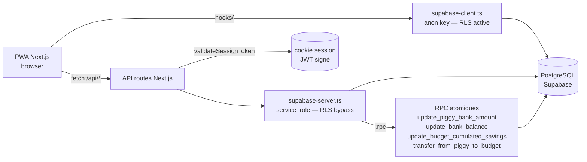
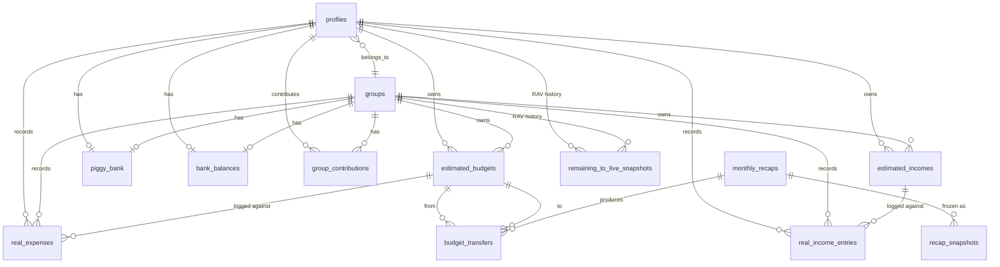

# Popoth

> Application web (PWA) francophone de gestion financière personnelle et en groupe.

Popoth aide un foyer ou un groupe à piloter mensuellement ses budgets : revenus estimés vs réels, dépenses planifiées vs réelles, économies cumulées par budget, tirelire commune, et un workflow de récap mensuel qui réconcilie le tout. La logique métier (allocation des dépenses, transferts inter-budgets, RAV — _reste à vivre_) est centralisée côté serveur ; le client est une PWA Next.js.

**Public cible** : un développeur seul ou en duo qui veut suivre ses finances avec des règles métier explicites (ordre d'imputation tirelire → économies budget → budget restant) plutôt qu'un agrégateur bancaire commercial.

---

## Sommaire

- [Stack](#stack)
- [Prérequis](#prérequis)
- [Installation](#installation)
- [Configuration](#configuration)
- [Commandes](#commandes)
- [Structure du projet](#structure-du-projet)
- [Architecture](#architecture)
- [Modèle de données](#modèle-de-données)
- [Tests & qualité](#tests--qualité)
- [Sécurité](#sécurité)
- [Déploiement](#déploiement)
- [Documentation](#documentation)
- [Conventions](#conventions)
- [Licence](#licence)

---

## Stack

| Couche | Technos |
|---|---|
| Framework | **Next.js 16.1.6** (App Router, webpack en dev / Turbopack en build) |
| UI | **React 19.1.1**, **Tailwind 3**, **shadcn/ui** (variant new-york) |
| Langage | **TypeScript 5** strict (`noUncheckedIndexedAccess`, `verbatimModuleSyntax`) |
| Backend | API routes Next.js + **Supabase** (PostgreSQL + Auth) (`@supabase/supabase-js@^2.57.4`) |
| Auth | JWT custom (`jose`) — pas Supabase Auth direct |
| Tests | **Vitest 4.1.5** (env `node`) |
| Package manager | **pnpm 9.15.5** (verrouillé), Node ≥ 20 |

`eslint-config-next 15.0.0` reste sur la version Next 15 — incompatible avec Next 16, ne pas upgrader avant le Sprint 1.

---

## Prérequis

- [Node.js](https://nodejs.org/) ≥ 20
- [pnpm](https://pnpm.io/) 9.x (`corepack enable && corepack prepare pnpm@9.15.5 --activate`)
- Un projet [Supabase](https://supabase.com/) (URL + clés service_role et anon)

Optionnel pour les opérations DB hors-app :
- Un [access token Supabase](https://supabase.com/dashboard/account/tokens) (`sbp_…`) pour scripts en API Management.
- Un mot de passe DB (Project Settings > Database > Reset password) pour `pnpm supabase ...`.

---

## Installation

```bash
git clone https://…/Popoth_App_Claude.git
cd Popoth_App_Claude
pnpm install
cp .env.example .env.local        # voir Configuration
pnpm dev                          # http://localhost:3000
```

---

## Configuration

`.env.local` (gitignored) doit contenir :

```ini
# Supabase
NEXT_PUBLIC_SUPABASE_URL=https://<your-project>.supabase.co
NEXT_PUBLIC_SUPABASE_PUBLISHABLE_KEY=...
NEXT_PUBLIC_SUPABASE_ANON_KEY=...
SUPABASE_SERVICE_ROLE_KEY=...     # utilisé par lib/supabase-server.ts (bypass RLS)

# Auth (JWT custom)
JWT_SECRET_KEY=...
```

Variables inline (jamais dans un fichier committé) pour les opérations CLI/scripts :

```ini
SUPABASE_ACCESS_TOKEN=sbp_...     # pour scripts/{export-schema,apply-sql,check-*}.mjs
SUPABASE_DB_PASSWORD=...          # pour pnpm supabase db push
```

Les tests gated lisent leurs propres variables : `SUPABASE_RPC_CONCURRENCY_TESTS=1`, `SUPABASE_RLS_TESTS=1`, `SUPABASE_API_TESTS=1`.

---

## Commandes

| Commande | Effet |
|---|---|
| `pnpm dev` | Serveur dev Next.js (webpack, HMR) |
| `pnpm build` | Build production (Turbopack) |
| `pnpm start` | Serveur production (après `build`) |
| `pnpm typecheck` | `tsc --noEmit` strict (BLOQUANT en CI) |
| `pnpm lint` | ESLint avec `--fix` |
| `pnpm lint:check` | ESLint sans modification |
| `pnpm test` | Vitest watch |
| `pnpm test:run` | Vitest single run (CI) |
| `pnpm db:types` | Régénère [lib/database.types.ts](./lib/database.types.ts) depuis le schéma prod |
| `pnpm db:check-drift` | Compare prod ↔ baseline `20260101000000_remote_schema.sql` |
| `pnpm db:check-rpcs` | Vérifie via `pg_proc` que les 4 RPC C3 existent en prod |
| `pnpm supabase ...` | CLI Supabase (lié au projet distant) |
| `node scripts/export-schema.mjs <out.sql>` | Snapshot du schéma prod via API Management |
| `node scripts/apply-sql.mjs <file.sql>` | Applique un .sql (write OU SELECT lecture seule) |

**Tests gated** (la suite skip sans la variable, donc CI standard reste rapide) :

```bash
SUPABASE_RPC_CONCURRENCY_TESTS=1 pnpm test:run   # rpc-concurrency.test.ts
SUPABASE_RLS_TESTS=1            pnpm test:run   # rls-isolation.test.ts
SUPABASE_API_TESTS=1            pnpm test:run   # api-regressions.test.ts
```

---

## Structure du projet

```
app/                       # App Router (pages + routes API)
  api/
    debug/                 # routes dev/seed — bloquées en prod via blockInProduction()
    finances/              # dashboard, expenses, income
    monthly-recap/         # workflow récap mensuel
    savings/transfer/      # transferts budget↔budget et budget↔tirelire
components/                # composants UI (shadcn/ui sous components/ui/)
contexts/                  # React contexts (AuthContext)
hooks/                     # 18 hooks React (useFinancialData, useGroups, ...)
lib/
  supabase-server.ts       # client serveur (service_role, BYPASS RLS)
  supabase-client.ts       # client browser (anon key, soumis à RLS)
  database.ts              # Database type augmenté avec les 4 RPC C3
  database.types.ts        # types Supabase générés
  session.ts               # JWT (jose) pour cookie session
  expense-allocation.ts    # règles d'allocation tirelire/savings/budget
  financial-calculations.ts # GOD FILE — chantier I4
  recap-snapshot.types.ts  # SnapshotPayload v1/v2 discriminé
  finance/                 # helpers RPC atomiques
    piggy-bank.ts          # updatePiggyBank, transferFromPiggyToBudget
    bank-balance.ts        # updateBankBalance
    budget-savings.ts      # updateBudgetCumulatedSavings
    __tests__/             # rpc-concurrency, rls-isolation (gated)
  __tests__/               # api-regressions (gated)
scripts/                   # outils API Management (sans Docker)
  export-schema.mjs        # snapshot prod schema → SQL baseline
  apply-sql.mjs            # applique un .sql
  check-drift.mjs          # backend de pnpm db:check-drift
  check-rpcs.mjs           # backend de pnpm db:check-rpcs
  list-triggers.sql        # SELECT pg_trigger pour inventaire
supabase/
  config.toml              # CLI config (lié au projet distant)
  migrations/              # baseline + migrations versionnées
docs/audit/                # audit complet codebase 2026-04
docs/db/                   # schéma + inventaire triggers
prompts/                   # prompts Claude Code par chantier
CLAUDE.md                  # guide pour sessions Claude Code
```

---

## Architecture



**Points-clés** :
- Deux clients Supabase coexistent. Le **server** (`supabase-server.ts`) bypass RLS, utilisé par toutes les routes API. Le **browser** (`supabase-client.ts`) est soumis à RLS et utilisé uniquement par les hooks. Les failles RLS s'exploitent via le browser, pas le server.
- Les **écritures sur les invariants financiers** (`piggy_bank.amount`, `bank_balances.balance`, `estimated_budgets.cumulated_savings`) **doivent passer par les helpers `lib/finance/*`** qui appellent les 4 RPC atomiques `SECURITY DEFINER`. Pas de SELECT-then-UPDATE direct.
- L'**auth** est un JWT custom signé via `jose`, vérifié par `validateSessionToken(request)` dans chaque route API. Pas Supabase Auth direct côté serveur.
- Le **workflow récap mensuel** (`app/api/monthly-recap/*`) est un état-machine en 3 étapes ; le cœur algorithmique (`process-step1`, >700 LOC) reste un god file en attente de refactor (chantier I5).

---

## Modèle de données



**Conventions DB** :
- Toutes les tables sont dans le schéma `public`.
- Pattern d'ownership : chaque ligne porte soit `profile_id` (perso), soit `group_id` (partagé), **jamais les deux** — enforce par CHECK `*_owner_exclusive_check`.
- IDs : `uuid PRIMARY KEY DEFAULT gen_random_uuid()`.
- RLS activée partout. Voir [docs/db/SCHEMA.md](./docs/db/SCHEMA.md) pour le détail policy par table.

---

## Tests & qualité

| Outil | Rôle |
|---|---|
| `pnpm typecheck` | TypeScript strict — bloquant |
| `pnpm lint:check` | ESLint — non-bloquant aujourd'hui (~144 errors progressives) |
| `pnpm test:run` | Vitest unit — toujours vert |
| `pnpm test:run` (gated) | Tests d'intégration contre Supabase prod, voir Configuration |
| `pnpm db:check-drift` | Compare prod ↔ baseline SQL — exit 1 si drift |
| `pnpm db:check-rpcs` | Vérifie les 4 RPC C3 dans `pg_proc` |

**Pas de mocks DB** dans les tests d'intégration (interdiction explicite — cf. CLAUDE.md §8). Les fixtures créent un `auth.users` réel via `admin.auth.admin.createUser` et nettoient en cascade dans `afterAll`.

CI : `.github/workflows/` contient un cron weekly `pnpm db:check-drift` (Sprint Hardening / H5).

---

## Sécurité

L'audit complet est dans [`docs/audit/00-executive-summary.md`](./docs/audit/00-executive-summary.md). État après Sprint Polish (~73/100) :

- ✅ Routes `/api/debug/*` bloquées en prod via [`lib/debug-guard.ts`](./lib/debug-guard.ts) — réponse 404 (pas 403, pour ne pas révéler l'existence).
- ✅ Mises à jour atomiques sur `piggy_bank` / `bank_balances` / `cumulated_savings` via 4 RPC `SECURITY DEFINER` (cf. [`supabase/migrations/20260506000000_create_finance_rpcs.sql`](./supabase/migrations/20260506000000_create_finance_rpcs.sql)). Tests de concurrence 100×parallèles dans `lib/finance/__tests__/rpc-concurrency.test.ts`.
- ✅ TypeScript strict appliqué au build (pas de `ignoreBuildErrors`).
- ✅ RLS activée partout, isolation cross-user testée (Sprint DB / D4).
- ✅ Drift detection automatisé : `pnpm db:check-drift`, `pnpm db:check-rpcs`, GH Actions cron weekly.
- ⚠️ **Trigger gap connu** (Sprint Audit-Triggers / v6) : 6 triggers `public.*` ne sont pas dans le baseline à cause d'un bug de filtre. Détail dans [`docs/db/SCHEMA.md`](./docs/db/SCHEMA.md) section Inventory.

L'historique des sprints sécurité est consigné dans [`CLAUDE.md`](./CLAUDE.md) §7.

---

## Déploiement

Pas de pipeline déploiement automatisé documenté. Le projet est conçu pour Vercel (Next.js stack) + Supabase managed (déjà provisionné sur `jzmppreybwabaeycvasz`). Les migrations sont appliquées via `pnpm supabase db push` ou `node scripts/apply-sql.mjs <fichier>` selon le cas (cf. CLAUDE.md §8 pour la push gate).

---

## Documentation

- [`CLAUDE.md`](./CLAUDE.md) — guide pour sessions [Claude Code](https://claude.com/claude-code) sur ce repo (conventions, à-faire/à-ne-pas-faire, état des lieux).
- [`docs/audit/`](./docs/audit/) — audit complet de la codebase (2026-04), 47/100 baseline, plan d'action multi-sprint.
  - [`00-executive-summary.md`](./docs/audit/00-executive-summary.md) — vue d'ensemble + score.
  - [`06-action-plan.md`](./docs/audit/06-action-plan.md) — plan multi-sprint.
  - [`RLS-FINDINGS.md`](./docs/audit/RLS-FINDINGS.md) — snapshot RLS pré-Sprint DB.
  - [`POST-MORTEM-C3-DRIFT.md`](./docs/audit/POST-MORTEM-C3-DRIFT.md) — post-mortem du drift `schema_migrations` ↔ `pg_proc`.
  - [`07-deep-dive-*.md`](./docs/audit/) — playbooks par chantier (financial-calculations, recap algorithm, RLS, testing strategy, Zod rollout, …).
- [`docs/db/SCHEMA.md`](./docs/db/SCHEMA.md) — carte des tables, RPC atomiques, indexes, FK, hot-path, inventaire complet des triggers prod.
- [`prompts/`](./prompts/) — prompts Claude Code par sprint, du Sprint 0 au Sprint Audit-Triggers.

---

## Conventions

Cf. [`CLAUDE.md`](./CLAUDE.md) §6 et §8 pour le détail. Résumé :

- **Format API** : `{ data: T } | { error: string }` partout, `401 'Session invalide'` si auth invalide, `404` (pas 403) pour les routes debug en prod.
- **TypeScript** : `import type` obligatoire (verbatimModuleSyntax), narrow systématique (noUncheckedIndexedAccess), pas de `any` dans le nouveau code, `as unknown as T` plutôt que `as any` quand un cast est inévitable.
- **Naming** : DB en `snake_case`, TS en `camelCase`, migrations Supabase nommées `<YYYYMMDDHHMMSS>_<verb>_<scope>.sql`.
- **Git** : Conventional Commits (`fix:`, `feat:`, `chore:`, `docs:`, `perf:`, `test:`), un commit par item dans les sprints multi-items, pas de `--amend` sur un commit publié, jamais `--no-verify` sans demande explicite.
- **DB writes** : pour `piggy_bank`/`bank_balances`/`cumulated_savings`, **toujours** via les helpers `lib/finance/*`. Pas de SELECT-then-UPDATE direct.

---

## Licence

Privé. Aucune licence open-source attribuée.
