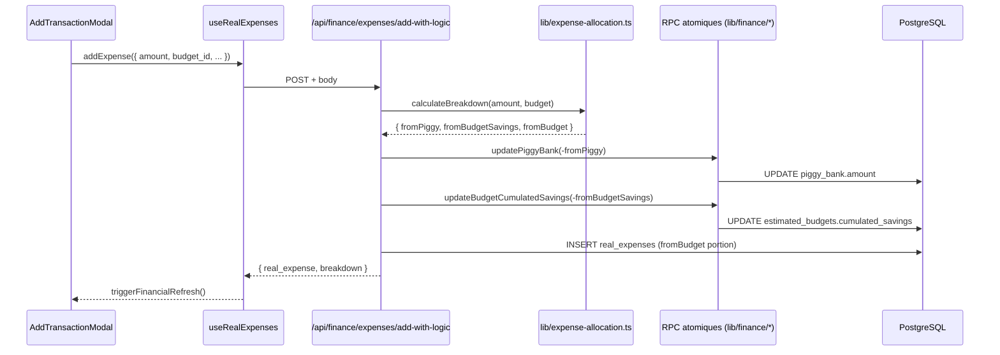

# `/api/finance/*` — Référence des endpoints

> Namespace canonique introduit par le Sprint Refactor-Architecture (livré 2026-05-08). Les anciens chemins (`/api/finances/*`, `/api/financial/*`, `/api/budgets`, `/api/incomes`) ont été supprimés au Sprint Refactor-Architecture-v2 (livré 2026-05-08).

## Pattern d'extraction

Chaque handler vit dans [`lib/api/finance/<route>.ts`](../../lib/api/finance/) (named exports `GET` / `POST` / `PUT` / `DELETE`). Les fichiers `app/api/finance/<path>/route.ts` ré-exportent simplement :

```ts
// app/api/finance/summary/route.ts
export { GET } from '@/lib/api/finance/summary'
```

Depuis le **Sprint Refactor-Architecture-v3** (livré 2026-05-08, finance) et le **Sprint Refactor-Architecture-v4** (livré 2026-05-08, Volet C — extension aux 21 routes hors finance), tous les handlers sont wrappés par un higher-order helper depuis [`lib/api/with-auth.ts`](../../lib/api/with-auth.ts). Le **Sprint Refactor-Architecture-v5** (livré 2026-05-09) a hardenisé le wrapper avec 2 overloads TypeScript par helper — la signature dynamic-route rend `routeContext` non-optionnel quand `<TParams>` est fourni, donc plus besoin du `routeContext!` aux 5 callsites de `app/api/groups/[id]/**`. Les routes finance n'utilisent pas de generic (toutes statiques sous `/api/finance/*`), donc le pattern call-site reste inchangé pour ce dossier :

```ts
// Auth + profile fetch (always-fetch handlers : budgets, incomes, rav, summary)
export const POST = withAuthAndProfile(async (request, { userId, profile }) => {
  // direct work — userId et profile.group_id disponibles, ownership condition à construire dans le body
})

// Auth seul (conditional-fetch handlers : budgets-estimated, expenses-*, income-{real,estimated,progress})
export const GET = withAuth(async (request, { userId }) => {
  // direct work — fetch lazy du profil seulement quand context==='group' ou forGroup=true
})
```

Le wrapper ne capture **pas** d'outer try/catch — chaque handler garde son `try/catch` route-aware avec `console.error('... /api/finance/X:', error)`. C'est volontaire : préserve aussi le fallback 200-with-default-data de `summary.ts` sur catch interne.

## Authentification

Toutes les routes valident le cookie `session` via le wrapper `withAuth` / `withAuthAndProfile` (qui appelle `validateSessionToken` depuis [`lib/session-server.ts`](../../lib/session-server.ts) en interne). Réponse harmonisée depuis Sprint v3 : `401 { error: 'Session invalide' }` (CLAUDE.md §6 — supplante l'ancienne drift `'Non autorisé'` / `'Non authentifié'`). En cas de profil introuvable (uniquement avec `withAuthAndProfile`) : `404 { error: 'Profil non trouvé' }`.

## Format de réponse

`{ <field>: T } | { error: string }`. Les shapes sont **non-uniformes** entre routes (héritage pré-sprint, à harmoniser dans un futur chantier Zod) :

- `summary` retourne `{ data: FinancialData, context, timestamp }`
- `rav` retourne `{ remainingToLive, context, timestamp }`
- `budgets/estimated` retourne `{ estimated_budgets: [...] }`
- `budgets` retourne `{ budgets: [...] }` ou `{ budget }`
- `incomes` retourne `{ incomes: [...] }` ou `{ income }`
- `income/real` retourne `{ real_income_entries, total, limit, offset }` ou `{ real_income_entry }`
- `expenses/real` retourne `{ real_expenses, ... }` ou `{ real_expense }`
- `expenses/preview-breakdown` retourne `{ breakdown: ExpenseBreakdownPreview }`
- `expenses/progress` et `income/progress` retournent un array `[...]` directement (pas de wrapper `{ data }`)

## Endpoints

### Summary / RAV

| Path                   | Verbes | Module                                                           | Consumer principal                                             |
| ---------------------- | ------ | ---------------------------------------------------------------- | -------------------------------------------------------------- |
| `/api/finance/summary` | GET    | [`lib/api/finance/summary.ts`](../../lib/api/finance/summary.ts) | [`hooks/useFinancialData.ts`](../../hooks/useFinancialData.ts) |
| `/api/finance/rav`     | GET    | [`lib/api/finance/rav.ts`](../../lib/api/finance/rav.ts)         | (lecture RAV persisté seul)                                    |

**Query params** :

- `summary` GET : `?context=profile|group` + `?recalculate=true` (force le recalcul, sinon RAV lu depuis DB).
- `rav` GET : `?context=profile|group`.

### Budgets

| Path                             | Verbes                 | Module                                                                               | Consumer                                                                          |
| -------------------------------- | ---------------------- | ------------------------------------------------------------------------------------ | --------------------------------------------------------------------------------- |
| `/api/finance/budgets`           | POST, PUT, DELETE      | [`lib/api/finance/budgets.ts`](../../lib/api/finance/budgets.ts)                     | [`hooks/useBudgets.ts`](../../hooks/useBudgets.ts) (write only — POST/PUT/DELETE) |
| `/api/finance/budgets/estimated` | GET, POST, PUT, DELETE | [`lib/api/finance/budgets-estimated.ts`](../../lib/api/finance/budgets-estimated.ts) | [`hooks/useBudgets.ts`](../../hooks/useBudgets.ts) (read — GET)                   |

**Query params** :

- `budgets` POST : body `{ name, estimatedAmount }` + query `?context=profile|group`.
- `budgets` PUT/DELETE : query `?id=<uuid>`.
- `budgets/estimated` GET : `?group=true` pour le contexte groupe.
- `budgets/estimated` POST : body `{ name, estimated_amount, is_monthly_recurring?, is_for_group? }`.
- `budgets/estimated` PUT : body `{ id, name?, estimated_amount?, is_monthly_recurring? }`.
- `budgets/estimated` DELETE : query `?id=<uuid>`.

### Incomes

| Path                            | Verbes                 | Module                                                                             | Consumer                                                     |
| ------------------------------- | ---------------------- | ---------------------------------------------------------------------------------- | ------------------------------------------------------------ |
| `/api/finance/incomes`          | GET, POST, PUT, DELETE | [`lib/api/finance/incomes.ts`](../../lib/api/finance/incomes.ts)                   | [`hooks/useIncomes.ts`](../../hooks/useIncomes.ts)           |
| `/api/finance/income/estimated` | GET, POST, PUT, DELETE | [`lib/api/finance/income-estimated.ts`](../../lib/api/finance/income-estimated.ts) | (lecture/écriture détaillée)                                 |
| `/api/finance/income/real`      | GET, POST, PUT, DELETE | [`lib/api/finance/income-real.ts`](../../lib/api/finance/income-real.ts)           | [`hooks/useRealIncomes.ts`](../../hooks/useRealIncomes.ts)   |
| `/api/finance/income/progress`  | GET                    | [`lib/api/finance/income-progress.ts`](../../lib/api/finance/income-progress.ts)   | [`hooks/useProgressData.ts`](../../hooks/useProgressData.ts) |

**Query params** :

- `income/real` GET : `?group=true&limit=50&offset=0`.
- `income/real` POST : body `{ amount, description, entry_date?, estimated_income_id?, is_for_group? }`.

### Expenses

| Path                                      | Verbes                 | Module                                                                                                 | Consumer                                                                                                                         |
| ----------------------------------------- | ---------------------- | ------------------------------------------------------------------------------------------------------ | -------------------------------------------------------------------------------------------------------------------------------- |
| `/api/finance/expenses/real`              | GET, POST, PUT, DELETE | [`lib/api/finance/expenses-real.ts`](../../lib/api/finance/expenses-real.ts)                           | [`hooks/useRealExpenses.ts`](../../hooks/useRealExpenses.ts) (read + update + delete)                                            |
| `/api/finance/expenses/add-with-logic`    | POST                   | [`lib/api/finance/expenses-add-with-logic.ts`](../../lib/api/finance/expenses-add-with-logic.ts)       | [`hooks/useRealExpenses.ts`](../../hooks/useRealExpenses.ts) (création avec allocation tirelire/savings/budget)                  |
| `/api/finance/expenses/preview-breakdown` | GET                    | [`lib/api/finance/expenses-preview-breakdown.ts`](../../lib/api/finance/expenses-preview-breakdown.ts) | [`components/dashboard/ExpenseBreakdownPreview.tsx`](../../components/dashboard/ExpenseBreakdownPreview.tsx)                     |
| `/api/finance/expenses/progress`          | GET                    | [`lib/api/finance/expenses-progress.ts`](../../lib/api/finance/expenses-progress.ts)                   | [`hooks/useProgressData.ts`](../../hooks/useProgressData.ts), [`hooks/useExpenseProgress.ts`](../../hooks/useExpenseProgress.ts) |

**Query params** :

- `expenses/preview-breakdown` GET : `?amount=42.50&budget_id=<uuid>&context=profile|group&expense_id=<uuid>` (le dernier exclut une dépense de la simulation).
- `expenses/add-with-logic` POST : body `{ amount, description, expense_date?, estimated_budget_id?, is_for_group? }` — gère l'allocation tirelire → savings → budget en RPC atomique.

## Routes hors `/api/finance/*` — wrappées en v4

Ces routes vivent dans `app/api/{path}/route.ts` (pas d'extraction `lib/api/<route>.ts`, contrairement à finance) mais utilisent toutes le wrapper `withAuth` / `withAuthAndProfile` depuis le **Sprint Refactor-Architecture-v4** (livré 2026-05-08) :

| Surface                                   | Routes            | Helper                                                                            |
| ----------------------------------------- | ----------------- | --------------------------------------------------------------------------------- |
| `/api/profile`                            | GET, POST, PUT    | `withAuth` (GET fait son `select('*')` + 200-on-no-profile en interne)            |
| `/api/savings/data`                       | GET               | `withAuthAndProfile`                                                              |
| `/api/savings/transfer`                   | POST              | `withAuthAndProfile`                                                              |
| `/api/bank-balance`                       | GET, POST         | `withAuth` + lazy fetch profil dans le body (conditional sur `context==='group'`) |
| `/api/groups`                             | GET, POST         | `withAuthAndProfile`                                                              |
| `/api/groups/search`                      | GET               | `withAuthAndProfile`                                                              |
| `/api/groups/contributions`               | GET, POST         | `withAuthAndProfile`                                                              |
| `/api/groups/[id]`                        | PUT, DELETE       | `withAuth<RouteParams>` (auth-only — auth check via groups table, pas profile)    |
| `/api/groups/[id]/members`                | GET, POST, DELETE | `withAuthAndProfile<RouteParams>`                                                 |
| `/api/monthly-recap/status`               | GET               | `withAuth` (délègue à `lib/recap/check-status.ts`)                                |
| `/api/monthly-recap/*` (12 autres routes) | divers            | `withAuthAndProfile`                                                              |

**Routes restantes hors wrapper** :

- `/api/auth/*` — login/logout/refresh — créent ou rafraîchissent la session, ne la valident pas.
- `/api/monthly-recap/process-step1` — god route, chantier I5 séparé (auth-only migration potentielle dans le Sprint v5 — voir [`prompts/prompt-03-architecture-v5.md`](../../prompts/prompt-03-architecture-v5.md)).
- `/api/debug/*` — bloquées en prod via `blockInProduction()` ; skipped du wrapper en v4 (low value, ~12 callsites éphémères).

## Diagramme de flux (allocation d'une dépense)



## Vérification

Pour la liste des routes au build :

```bash
pnpm build 2>&1 | grep "/api/finance"
# Doit lister les 12 paths sous /api/finance/ (tous canoniques)
```

## Vérifications de cohérence post-Sprint-v3 + v4

```bash
# Aucun callsite direct de validateSessionToken dans les surfaces wrappées
rg -n "validateSessionToken" lib/api/finance/   # → 0 lignes
rg -n "validateSessionToken" app/api/{savings,groups,profile,monthly-recap,bank-balance}/
# → seulement app/api/monthly-recap/process-step1/route.ts (god route, exclue)

# Messages d'erreur harmonisés sur 'Session invalide' (CLAUDE.md §6)
rg -n "'Non autoris" app/api/                   # → seulement app/api/debug/{financial,group-financial}/route.ts
rg -n "'Non authentifi" app/api/                # → 0 lignes (sauf debug routes restantes)
```
