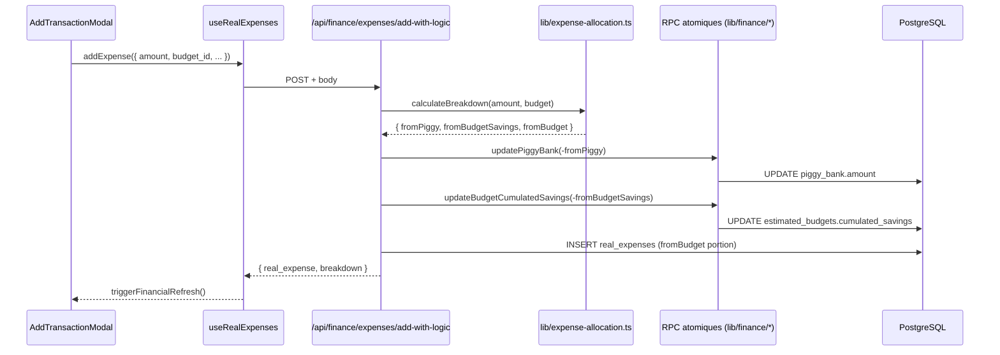

# `/api/finance/*` — Référence des endpoints

> Namespace canonique introduit par le Sprint Refactor-Architecture (livré 2026-05-08). Les anciens chemins (`/api/finances/*`, `/api/financial/*`, `/api/budgets`, `/api/incomes`) restent en alias avec un header `Deprecation: true` pendant 1 sprint d'observation, puis seront supprimés via [`prompts/prompt-03-architecture-v2.md`](../../prompts/prompt-03-architecture-v2.md).

## Pattern d'extraction

Chaque handler vit dans [`lib/api/finance/<route>.ts`](../../lib/api/finance/) (named exports `GET` / `POST` / `PUT` / `DELETE`). Les fichiers `app/api/finance/<path>/route.ts` ré-exportent simplement :

```ts
// app/api/finance/dashboard/route.ts
export { GET, POST } from '@/lib/api/finance/dashboard'
```

Les anciens chemins wrappent les mêmes handlers avec [`lib/api/with-deprecation.ts`](../../lib/api/with-deprecation.ts) :

```ts
// app/api/finances/dashboard/route.ts (DEPRECATED)
import { GET as financeDashboardGet, POST as financeDashboardPost } from '@/lib/api/finance/dashboard'
import { withDeprecation } from '@/lib/api/with-deprecation'
export const GET = withDeprecation(financeDashboardGet)
export const POST = withDeprecation(financeDashboardPost)
```

## Authentification

Toutes les routes valident le cookie `session` via `validateSessionToken(request)` (cf. [`lib/session-server.ts`](../../lib/session-server.ts)). Réponse `401 { error: 'Non autorisé' }` ou `401 { error: 'Non authentifié' }` selon la route si invalide.

## Format de réponse

`{ <field>: T } | { error: string }`. Les shapes sont **non-uniformes** entre routes (héritage pré-sprint, à harmoniser dans un futur chantier Zod) :
- `dashboard` retourne `{ dashboard: FinancialDashboardData }`
- `summary` retourne `{ data: FinancialData, context, timestamp }`
- `rav` retourne `{ remainingToLive, context, timestamp }`
- `budgets/estimated` retourne `{ estimated_budgets: [...] }`
- `budgets` retourne `{ budgets: [...] }` ou `{ budget }`
- `incomes` retourne `{ incomes: [...] }` ou `{ income }`
- `income/real` retourne `{ real_income_entries, total, limit, offset }` ou `{ real_income_entry }`
- `expenses/real` retourne `{ real_expenses, ... }` ou `{ real_expense }`
- `expenses/preview-breakdown` retourne `{ breakdown: ExpenseBreakdownPreview }`
- `expenses/progress` et `income/progress` retournent un array `[...]` directement (pas de wrapper `{ data }`)

## Endpoints

### Dashboard / Summary / RAV

| Path | Verbes | Module | Consumer principal |
|---|---|---|---|
| `/api/finance/dashboard` | GET, POST | [`lib/api/finance/dashboard.ts`](../../lib/api/finance/dashboard.ts) | _dashboard UI complet_ — pas de hook applicatif identifié, à investiguer (cf. prompt-v2) |
| `/api/finance/summary` | GET | [`lib/api/finance/summary.ts`](../../lib/api/finance/summary.ts) | [`hooks/useFinancialData.ts`](../../hooks/useFinancialData.ts) |
| `/api/finance/rav` | GET | [`lib/api/finance/rav.ts`](../../lib/api/finance/rav.ts) | (lecture RAV persisté seul) |

**Query params** :
- `dashboard` GET : `?group=true` pour le contexte groupe.
- `dashboard` POST : `{ for_group?: boolean }` body — déclenche un recalcul (insert+delete dummy entry).
- `summary` GET : `?context=profile|group` + `?recalculate=true` (force le recalcul, sinon RAV lu depuis DB).
- `rav` GET : `?context=profile|group`.

**Note** : `dashboard` (456 LOC) et `summary` (141 LOC) ont des shapes différentes — le premier assemble manuellement le breakdown UI (incomes + budgets + expenses + monthly_summary), le second renvoie `FinancialData` brut (cf. [`lib/financial-calculations.ts`](../../lib/financial-calculations.ts)). À consolider ou nettoyer dans le sprint v2.

### Budgets

| Path | Verbes | Module | Consumer |
|---|---|---|---|
| `/api/finance/budgets` | GET, POST, PUT, DELETE | [`lib/api/finance/budgets.ts`](../../lib/api/finance/budgets.ts) | [`hooks/useBudgets.ts`](../../hooks/useBudgets.ts) (write only — POST/PUT/DELETE) |
| `/api/finance/budgets/estimated` | GET, POST, PUT, DELETE | [`lib/api/finance/budgets-estimated.ts`](../../lib/api/finance/budgets-estimated.ts) | [`hooks/useBudgets.ts`](../../hooks/useBudgets.ts) (read — GET) |

**Note** : la GET de `/api/finance/budgets` n'a aucun consumer applicatif. Candidat à la suppression dans le sprint v2.

**Query params** :
- `budgets` GET : `?context=profile|group`.
- `budgets` POST : body `{ name, estimatedAmount }` + query `?context=profile|group`.
- `budgets` PUT/DELETE : query `?id=<uuid>`.
- `budgets/estimated` GET : `?group=true` pour le contexte groupe.
- `budgets/estimated` POST : body `{ name, estimated_amount, is_monthly_recurring?, is_for_group? }`.
- `budgets/estimated` PUT : body `{ id, name?, estimated_amount?, is_monthly_recurring? }`.
- `budgets/estimated` DELETE : query `?id=<uuid>`.

### Incomes

| Path | Verbes | Module | Consumer |
|---|---|---|---|
| `/api/finance/incomes` | GET, POST, PUT, DELETE | [`lib/api/finance/incomes.ts`](../../lib/api/finance/incomes.ts) | [`hooks/useIncomes.ts`](../../hooks/useIncomes.ts) |
| `/api/finance/income/estimated` | GET, POST, PUT, DELETE | [`lib/api/finance/income-estimated.ts`](../../lib/api/finance/income-estimated.ts) | (lecture/écriture détaillée) |
| `/api/finance/income/real` | GET, POST, PUT, DELETE | [`lib/api/finance/income-real.ts`](../../lib/api/finance/income-real.ts) | [`hooks/useRealIncomes.ts`](../../hooks/useRealIncomes.ts) |
| `/api/finance/income/progress` | GET | [`lib/api/finance/income-progress.ts`](../../lib/api/finance/income-progress.ts) | [`hooks/useProgressData.ts`](../../hooks/useProgressData.ts) |

**Query params** :
- `income/real` GET : `?group=true&limit=50&offset=0`.
- `income/real` POST : body `{ amount, description, entry_date?, estimated_income_id?, is_for_group? }`.

### Expenses

| Path | Verbes | Module | Consumer |
|---|---|---|---|
| `/api/finance/expenses/real` | GET, POST, PUT, DELETE | [`lib/api/finance/expenses-real.ts`](../../lib/api/finance/expenses-real.ts) | [`hooks/useRealExpenses.ts`](../../hooks/useRealExpenses.ts) (read + update + delete) |
| `/api/finance/expenses/add-with-logic` | POST | [`lib/api/finance/expenses-add-with-logic.ts`](../../lib/api/finance/expenses-add-with-logic.ts) | [`hooks/useRealExpenses.ts`](../../hooks/useRealExpenses.ts) (création avec allocation tirelire/savings/budget) |
| `/api/finance/expenses/preview-breakdown` | GET | [`lib/api/finance/expenses-preview-breakdown.ts`](../../lib/api/finance/expenses-preview-breakdown.ts) | [`components/dashboard/ExpenseBreakdownPreview.tsx`](../../components/dashboard/ExpenseBreakdownPreview.tsx) |
| `/api/finance/expenses/progress` | GET | [`lib/api/finance/expenses-progress.ts`](../../lib/api/finance/expenses-progress.ts) | [`hooks/useProgressData.ts`](../../hooks/useProgressData.ts), [`hooks/useExpenseProgress.ts`](../../hooks/useExpenseProgress.ts) |

**Query params** :
- `expenses/preview-breakdown` GET : `?amount=42.50&budget_id=<uuid>&context=profile|group&expense_id=<uuid>` (le dernier exclut une dépense de la simulation).
- `expenses/add-with-logic` POST : body `{ amount, description, expense_date?, estimated_budget_id?, is_for_group? }` — gère l'allocation tirelire → savings → budget en RPC atomique.

## Routes hors `/api/finance/*` (non concernées par ce sprint)

Ces routes restent structurellement inchangées (l'unification n'a pas étendu à elles) :
- `/api/auth/*` — login/logout/refresh JWT
- `/api/profile` — lecture/maj profil
- `/api/groups`, `/api/groups/[id]`, `/api/groups/[id]/members`, `/api/groups/contributions`, `/api/groups/search`
- `/api/savings/data`, `/api/savings/transfer`
- `/api/monthly-recap/*` — workflow récap mensuel (god route `process-step1` exclue du refactor I5)
- `/api/debug/*` — bloquées en prod via `blockInProduction()`

Si une extension du pattern `withDeprecation` à ces surfaces est envisagée, voir le **Volet C** de [`prompts/prompt-03-architecture-v2.md`](../../prompts/prompt-03-architecture-v2.md).

## Diagramme de flux (allocation d'une dépense)



## Vérification

Pour confirmer en local que les anciens chemins répondent avec le header `Deprecation: true` :

```bash
pnpm dev
# Dans un autre terminal :
curl -i -b "session=<token>" http://localhost:3000/api/finances/dashboard
# Attendu : 200 + header `Deprecation: true`
curl -i -b "session=<token>" http://localhost:3000/api/finance/dashboard
# Attendu : 200 SANS header Deprecation
```

Pour la liste des routes au build :

```bash
pnpm build 2>&1 | grep "/api/finance"
# Doit lister les 13 nouveaux paths sous /api/finance/
```
