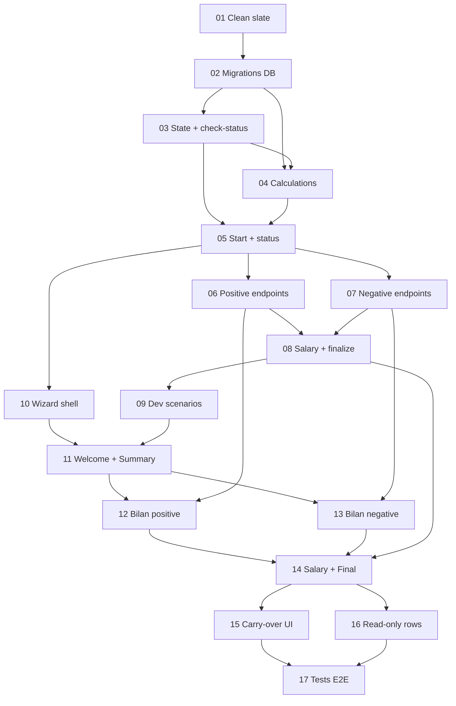

# Monthly Recap V3 — Prompts d'implémentation séquentielle

> Décomposition de la feature **Monthly Recap V3** (processus mensuel obligatoire, wizard 5 écrans, gestion bilan positif/négatif, salary update, finalize) en 17 sous-tâches autonomes prêtes à être exécutées une-par-une dans des sessions Claude Code futures.

## Vue d'ensemble de la feature

Le **Monthly Recap** est un processus mensuel obligatoire qui se déclenche à la première connexion de chaque mois. Il bloque l'accès au dashboard tant qu'il n'est pas terminé. Il existe **un recap par dashboard** : un personnel et un de groupe. L'utilisateur fait le bilan du mois écoulé puis gère ses surplus (cas bilan positif) ou son déficit (cas bilan négatif) via un wizard 5 écrans. Toutes les actions sont persistées immédiatement (sauf le snapshot ligne 3 et les transactions, différés au finalize).

**Spec complète** : voir le document originel transmis lors de la mission (sections 1-8).

**Décisions structurantes lockées en amont** :
- **Clean slate V1+V2** : suppression complète du code + tables DB des anciennes versions, repartir from scratch sans suffix V3 sur les nouvelles tables (`monthly_recaps`, `recap_snapshots`) ni sur les libs (`lib/recap/`).
- **Group lock** : posé par l'initiateur (`started_by_profile_id`), seul lui peut finir le recap. Debug route pour libérer un groupe coincé.
- **Carry-over delete** : DELETE expense reportée → `piggy_bank.amount += amount` via nouvelle RPC. DELETE income reportée = pur retrait.
- **Read-only rows** (salaire/contribution) : virtual UI-only, exposées via `meta.readOnlyIncomes` sur `FinancialData`. Zéro migration DB pour ce cas.
- **Salary update endpoint** : scoped recap (`POST /api/monthly-recap/update-salaries`), appel explicite `calculate_group_contributions` après UPDATE profiles. Pas de nouveau trigger DB.

## Table des sous-tâches

| # | Phase | Titre | Estimation | Lien |
|---|-------|-------|------------|------|
| **01** | A. Foundations | Clean slate : suppression V1+V2 | 1h | [01-clean-slate.md](./01-clean-slate.md) |
| **02** | A | Migrations DB : monthly_recaps + carry-over | 1h | [02-migrations-db.md](./02-migrations-db.md) |
| **03** | A | State + check-status + lock + Zod schemas | 1.5h | [03-state-check-status-lock.md](./03-state-check-status-lock.md) |
| **04** | A | Calculs purs : bilan, surplus, refloat proportionnel | 1.5h | [04-calculations.md](./04-calculations.md) |
| **05** | B. Endpoints | Start + status + proxy re-wiring | 1.5h | [05-start-status-endpoints.md](./05-start-status-endpoints.md) |
| **06** | B | Endpoints flow positif (4.A) | 1.5h | [06-positive-flow-endpoints.md](./06-positive-flow-endpoints.md) |
| **07** | B | Endpoints flow négatif (4.B) | 2h | [07-negative-flow-endpoints.md](./07-negative-flow-endpoints.md) |
| **08** | B | Salary + finalize endpoints + RPCs | 2h | [08-salary-finalize-endpoints.md](./08-salary-finalize-endpoints.md) |
| **09** | C. Dev | Dev scenarios + reset routes | 1.5h | [09-dev-scenarios-reset.md](./09-dev-scenarios-reset.md) |
| **10** | D. UI | Wizard shell + progress + lock screen | 1.5h | [10-wizard-shell-lock-screen.md](./10-wizard-shell-lock-screen.md) |
| **11** | D | Screens 1 & 2 : Welcome + Summary + drawers | 1.5h | [11-screens-welcome-summary.md](./11-screens-welcome-summary.md) |
| **12** | D | Screen 3A : Bilan positif | 1.5h | [12-screen-bilan-positive.md](./12-screen-bilan-positive.md) |
| **13** | D | Screen 3B : Bilan négatif | 2h | [13-screen-bilan-negative.md](./13-screen-bilan-negative.md) |
| **14** | D | Screens 4 & 5 : Salary + Final | 1.5h | [14-screens-salary-final.md](./14-screens-salary-final.md) |
| **15** | E. Dashboard | Carry-over UI + RPCs + filter | 2h | [15-carry-over-ui-rpcs.md](./15-carry-over-ui-rpcs.md) |
| **16** | E | Read-only virtual rows | 1h | [16-readonly-virtual-rows.md](./16-readonly-virtual-rows.md) |
| **17** | F. Tests | Intégration + E2E 20+ cas | 2h | [17-integration-tests-e2e.md](./17-integration-tests-e2e.md) |

**Estimation totale** : ~26h (environ 17-20 sessions Claude Code de 30min-2h chacune).

## Diagramme de dépendances

## Ordre d'exécution recommandé

**Phase A — Foundations (4 sessions, ~5h)** : `01 → 02 → 03 → 04`
> Aucune UI tangible. Permet de poser les fondations DB + logique pure + Zod. À la fin, lint+typecheck+tests pure passants.

**Phase B — Endpoints serveur (4 sessions, ~7h)** : `05 → 06 → 07 → 08`
> Le serveur est complet end-to-end mais sans UI. Testable via curl + tests gated. À la fin, on peut faire un cycle complet du recap via API.

**Phase C — Dev tools (1 session, ~1.5h)** : `09`
> Permet de seeder 20+ scénarios pour itérer sur l'UI sans avoir à fixer la DB manuellement.

**Phase D — UI Wizard (5 sessions, ~8h)** : `10 → 11 → 12 → 13 → 14`
> Le wizard prend forme écran par écran. À la fin de 14, l'utilisateur peut faire un recap complet via UI mobile-first.

**Phase E — Dashboard integration (2 sessions, ~3h)** : `15 → 16`
> Post-recap, le dashboard reflète l'état (transactions reportées avec badge, salary read-only). À la fin, le cycle complet est cohérent : recap → dashboard montre le résultat.

**Phase F — Tests E2E (1 session, ~2h)** : `17`
> 20+ cas de tests gated couvrent tous les parcours documentés dans la spec. Baseline tests V3 actée. Feature prête pour merge.

## Convention de naming établie

Code et DB sans suffix V3 (puisque V1+V2 sont supprimés complètement) :

- **Tables DB** : `monthly_recaps`, colonnes `is_carried_over` + `carried_from_recap_id` sur `real_expenses` et `real_income_entries`
- **Lib folders** : `lib/recap/` (calculations, check-status, state, lock, actions-positive, actions-negative, actions-salary, load-summary, carry-over)
- **Routes API** : `/api/monthly-recap/{start,status,advance-step,transfer-surpluses-to-piggy,transform-remaining-surpluses-to-savings,refloat-from-piggy,refloat-from-savings,save-budget-snapshot,update-salaries,complete}`
- **Composants** : `components/monthly-recap/` (RecapShell, RecapWizard, RecapProgressFrieze, GroupLockScreen, steps/{Welcome,Summary,BilanPositive,BilanNegative,SalaryUpdate,FinalRecap}, drawers/{SurplusDetail,SavingsDetail,SurplusSelection}, Refloat{Piggy,Savings,BudgetSnapshot}Line, BilanBlock, GroupMemberSalaryForm)
- **Hooks** : `hooks/useMonthlyRecap.ts`
- **Dev tools** : `/dev/recap`, `/api/debug/recap/{scenarios,seed,reset}`, `lib/dev/recap-scenarios.ts`, `lib/dev/apply-scenario.ts`

## RPCs ajoutées (au total : 13 → 21)

Au début (post clean-slate 01) : 13 RPCs domain-agnostiques préservées. À la fin (post 17) : **21 RPCs**.

Nouvelles RPCs ajoutées :
- `start_monthly_recap` (05) — claim lock atomique
- `finalize_recap_apply_snapshot` (08) — UPDATE carryover_spent_amount par budget
- `process_recap_transactions` (08) — DELETE applied + UPDATE is_carried_over
- `toggle_carry_over_and_apply` (15) — uncarry expense + apply au solde atomique
- `toggle_carry_over_and_apply_income` (15) — miroir income
- `delete_carried_expense_to_piggy` (15) — DELETE carried + credit piggy atomique
- Optionnel `advance_monthly_recap_step` (si décision de créer un endpoint dédié vs UPDATE inline — voir 11/13)

À chaque ajout : maj `EXPECTED_RPCS` dans `scripts/check-rpcs.mjs` + CLAUDE.md §5.5 invariants.

## Migrations DB (au total : 4-5)

1. **01-drop-legacy** (01) : DROP V1+V2 tables + FK column `budget_transfers.monthly_recap_id`.
2. **02-create-monthly-recaps** (02) : CREATE TABLE monthly_recaps avec state machine + lock + snapshot.
3. **02-add-carry-over** (02) : ALTER TABLE real_expenses + real_income_entries ADD COLUMN is_carried_over + carried_from_recap_id.
4. **05-create-recap-start-rpc** (05) : start_monthly_recap RPC.
5. **08-create-recap-finalize-rpcs** (08) : finalize_recap_apply_snapshot + process_recap_transactions.
6. **15-create-carry-over-rpcs** (15) : 3 RPCs carry-over.

## Tests cibles

| Type | Estimation finale |
|------|-------------------|
| Tests non-gated (pure unit + RTL) | ~80+ cas nouveaux |
| Tests gated `SUPABASE_RECAP_TESTS=1` | ~50+ cas nouveaux |
| Tests gated `SUPABASE_API_TESTS=1` | +2-3 cas (regressions UI dashboard post-recap) |

## Workflow par session

Pour chaque sous-tâche, le Claude Code futur ne lit QUE le prompt correspondant + a accès au codebase. Le prompt contient :
- Contexte de la feature globale + position dans la séquence
- Fichiers concernés (créer/modifier/lire)
- Patterns à respecter (avec links absolus vers fichiers de référence)
- Étapes d'implémentation suggérées
- Critères d'acceptation cochables
- Tests à écrire (liste explicite)
- Pièges et points d'attention
- Commandes utiles
- Definition of Done

## Suggestions opérationnelles

- **Un commit par sous-tâche** (ou groupe cohérent dans une sous-tâche multi-fichiers). Conventional Commits enforced par husky `commit-msg` hook.
- **`pnpm verify` après chaque sous-tâche** pour valider l'état du repo (typecheck + lint:check + format:check + tests + 6 db:* checks). Si exit non-0, fixer avant de passer à la suivante.
- **Lancer le smoke test manuel** indiqué dans le "Definition of Done" de chaque sous-tâche, pas seulement le typecheck. Le typecheck ne capture pas les régressions UX runtime.
- **Préserver la baseline 0 errors / 0 warnings** sur `pnpm lint:check` (CLAUDE.md §5.5 invariant).
- **Documentation closeout** : à la fin (post 17), créer `.claude/history/roadmap-detailed-NN-monthly-recap-v3.md` avec le résumé des 17 sous-tâches livrées, score audit, baselines tests.

## Ambiguïtés résiduelles non bloquantes

Quelques décisions mineures laissées au libre arbitre de l'implémentation (documentées dans les prompts) :

1. **`computeProportionalBudgetSnapshot` (04)** : algorithme égalisé vs proportional. Recommandation = proportional sur `estimatedAmount - currentCarryoverSpent`. Documenter dans le commit message.
2. **Endpoint `advance-step` (11)** : créer un endpoint dédié OU laisser les endpoints suivants advance implicitly. Recommandation = endpoint dédié pour clarté state machine.
3. **`recap_snapshots` table V3** : laissée hors scope (toutes les données interim vivent dans `monthly_recaps.budget_snapshot_data` JSONB). Si un besoin de snapshot historique surface, créer la table dans un sprint futur dédié.
4. **Bascule UI flow positif après piggy refloat surplus** (13) : test la condition `piggy_refloat > deficit_initial`, switch sur BilanPositiveStep avec synthetic summary. Peut être affiné selon l'expérience UX.

## État de départ

Au moment de commencer cette série de prompts, le repo est dans l'état suivant (vérifié au moment de la décomposition) :

- Branche : `monthly_recap` (à confirmer)
- V2 ossature présente : `app/monthly-recap/page.tsx` (stub), `app/api/monthly-recap/complete/route.ts` (stub), `lib/recap/check-status.ts`, `proxy.ts` avec gating
- V1 legacy présent : `app/api/monthly-recap-legacy/`, `lib/recap-legacy/`, `components/monthly-recap-legacy/`, `hooks/legacy/`, `lib/schemas/recap-legacy.ts`
- Dev tools V2 : `/dev/recap-v2/`, `/api/debug/recap-v2/{reset,scenarios,seed}/`
- Score audit estimé ~100/100, lint baseline 0/0, tests 520 non-gated + 108 gated skipped
- 13 RPCs domain-agnostiques (cf. EXPECTED_RPCS dans scripts/check-rpcs.mjs)

Tout ceci est nettoyé/recréé au fil des 17 sous-tâches.

---

**Bon courage** 🚀. La feature est ambitieuse mais bien découpée — chaque session a un livrable autonome et testable.
